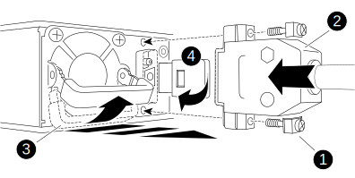

Replacing a power supply (PSU) involves disconnecting the target PSU from the power source, unplugging the power cable, removing the old PSU and installing the replacement PSU, and then reconnecting it to the power source.

* The power supplies are redundant and hot-swappable.
* This procedure is written for replacing one PSU at a time.
+
NOTE: It is a best practice to replace the PSU within two minutes of removing it from the chassis. The system continues to function, but ONTAP sends messages to the console about the degraded PSU until the PSU is replaced.

* Power supplies are auto-ranging.
+
IMPORTANT: Do not mix PSUs with different efficiency ratings. Always replace like for like.

Use the appropriate procedure for your type of PSU; AC or DC.  

[role="tabbed-block"]
====

.Option 1: Replace an AC PSU
--
Use the following video or the tabulated steps to replace the PSU:

video::86487f5e-20ff-43e6-99ae-ac5b015c1aa5[panopto, title="Animation - Replace the AC PSU"]

. If you are not already grounded, properly ground yourself.
. Identify the PSU you want to replace, based on console error messages or through the red Fault LED on the PSU.
. Disconnect the PSU:
.. Open the power cable retainer, and then unplug the power cable from the PSU.
. Remove the PSU by rotating the handle up, press the locking tab, and then pull the PSU out of the controller module.
+
CAUTION: The PSU is short. Always use two hands to support it when removing it from the controller module so that it does not suddenly swing free from the controller module and injure you.
+
image::../media/drw_a250_replace_psu.png[]
+
|===
a|
image:../media/legend_icon_01.png[]|
Blue PSU locking tab
a|
image:../media/legend_icon_02.png[]
a|
Power supply
|===

. Install the replacement PSU in the controller module:
.. Using both hands, support and align the edges of the PSU with the opening in the controller module.
.. Gently push the PSU into the controller module until the locking tab clicks into place.
+
The power supplies will only properly engage with the internal connector and lock in place one way.
+
NOTE: To avoid damaging the internal connector, do not use excessive force when sliding the PSU into the system.

. Reconnect the PSU cabling:
.. Reconnect the power cable to the PSU.
.. Secure the power cable to the PSU using the power cable retainer.

+
Once power is restored to the PSU, the status LED should be green.

include::../_include/complete_rma_step.adoc[]
--
.Option 2: Replace a DC PSU
--
To replace a DC PSU, complete the following steps.

. If you are not already grounded, properly ground yourself.
. Identify the PSU you want to replace, based on console error messages or through the red Fault LED on the PSU.
. Disconnect the PSU:
.. Unscrew the D-SUB DC power cable connector using the thumb screws on the plug.
.. Unplug the power cable from the PSU and set it aside. 
. Remove the PSU by rotating the handle up, press the locking tab, and then pull PSU out of the controller module.

+
CAUTION: The PSU is short. Always use two hands to support it when removing it from the controller module so that it does not suddenly swing free from the controller module and injure you.
+

+
[cols="1,3"]
|===
a|
image:../media/legend_icon_01.svg[width=10px]
a|
Thumb screws
a| 
image:../media/legend_icon_02.svg[width=10px]
a|
D-SUB DC power cable connector
a|
image:../media/legend_icon_03.svg[width=10px]
a|
Power supply handle
a|
image:../media/legend_icon_04.svg[width=10px]
a|
Blue PSU locking tab
|===

. Install the replacement PSU in the controller module:
.. Using both hands, support and align the edges of the PSU with the opening in the controller module.
.. Gently push the PSU into the controller module until the locking tab clicks into place.
+
The power supplies will only properly engage with the internal connector and lock in place one way.
+
NOTE: To avoid damaging the internal connector, do not use excessive force when sliding the PSU into the system.

. Reconnect the D-SUB DC power cable:
 .. Plug the power cable connector into the PSU.
 .. Secure the power cable to the PSU with the thumbscrews.
+
Once power is restored to the PSU, the status LED should be green.

include::../_include/complete_rma_step.adoc[]
--

====
