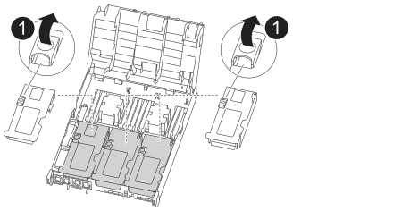
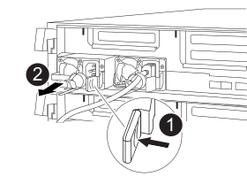
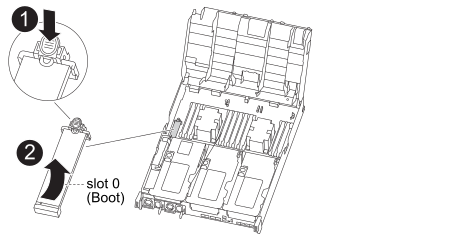
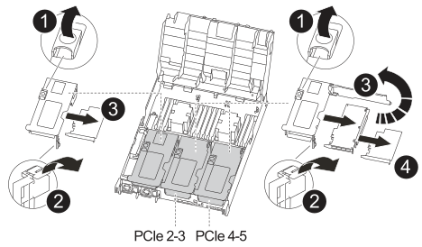
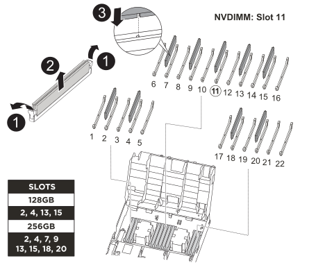
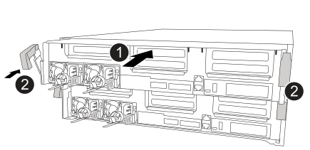

To replace the controller module hardware, you must remove the impaired controller, move FRU components to the replacement controller module, install the replacement controller module in the chassis, and then boot the system to Maintenance mode.

== Step 1: Remove the controller module

To access components inside the controller module, you must remove the controller module from the chassis.

. If you are not already grounded, properly ground yourself.
. Release the power cable retainers, and then unplug the cables from the power supplies.
. Loosen the hook and loop strap binding the cables to the cable management device, and then unplug the system cables and SFPs (if needed) from the controller module, keeping track of where the cables were connected.
+
Leave the cables in the cable management device so that when you reinstall the cable management device, the cables are organized.

. Remove the cable management device from the controller module and set it aside.
. Press down on both of the locking latches, and then rotate both latches downward at the same time.
+
The controller module moves slightly out of the chassis.
+
image::../media/drw_c400_remove_controller_IEOPS-1216.svg[width=500px]
+
|===
a|
image:../media/legend_icon_01.png[] a|
Locking latches  
a|
image:../media/legend_icon_02.png[]
a|
Controller moves slightly out of chassis
|===

. Slide the controller module out of the chassis.
+
Make sure that you support the bottom of the controller module as you slide it out of the chassis.

. Place the controller module on a stable, flat surface.
. On the replacement controller module, open the air duct and remove the empty risers from the controller module using the animation, illustration, or the written steps:
+
video::018a1c3c-0a26-4f48-bd60-b0300184c147[panopto, title="Animation - Remove the empty risers from the replacement controller module"]
+

+
 .. Press the locking tabs on the sides of the air duct in toward the middle of the controller module.
 .. Slide the air duct toward the back of the controller module, and then rotate it upward to its completely open position.
 .. Rotate the riser locking latch on the left side of riser 1 up and toward air duct, lift the riser up, and then set it aside.
 .. Repeat the previous step for the remaining risers.

== Step 2: Move the power supplies

You must move the power supply from the impaired controller module to the replacement controller module when you replace a controller module.

You can use the following animation, illustration, or the written steps to move the power supplies to the replacement controller module.

video::6cac8f5f-dc11-4b1d-9b18-b03001858fda[panopto, title="Animation - Move the power supplies"]

. Remove the power supply:
+

[cols="10,90"]
|===
a|
image:../media/legend_icon_01.png[Callout number 1] 
a|
PSU locking tab
a|
image:../media/legend_icon_02.png[Callout number 2]
a|
Power cable retainer
|===

 .. Rotate the cam handle so that it can be used to pull the power supply out of the chassis.
 .. Press the blue locking tab to release the power supply from the chassis.
 .. Using both hands, pull the power supply out of the chassis, and then set it aside.
. Move the power supply to the new controller module, and then install it.
. Using both hands, support and align the edges of the power supply with the opening in the controller module, and then gently push the power supply into the controller module until the locking tab clicks into place.
+
The power supplies will only properly engage with the internal connector and lock in place one way.
+
NOTE: To avoid damaging the internal connector, do not use excessive force when sliding the power supply into the system.

. Repeat the preceding steps for any remaining power supplies.

== Step 3: Move the NVDIMM battery

To move the NVDIMM battery from the impaired controller module to the replacement controller module, you must perform a specific sequence of steps.

You can use the following animation, illustration, or the written steps to move the NVDIMM battery from the impaired controller module to the replacement controller module.

video::d38ef37e-aa0e-46ff-9283-b03001864e0c[panopto, title="Animation - Move the NVDIMM battery"]

image::../media/drw_c400_nvdimm_batt_IEOPS-1227.svg[width=550px]

[cols="10,90"]
|===
a|
image:../media/legend_icon_01.png[Callout number 1] 
a|
NVDIMM battery plug
a|
image:../media/legend_icon_02.png[Callout number 2]
a|
NVDIMM battery locking tab
a|
image:../media/legend_icon_03.png[Callout number 3]
a|
NVDIMM battery
|===

. Open the air duct:
 .. Press the locking tabs on the sides of the air duct in toward the middle of the controller module.
 .. Slide the air duct toward the back of the controller module, and then rotate it upward to its completely open position.
. Locate the NVDIMM battery in the controller module.
. Locate the battery plug and squeeze the clip on the face of the battery plug to release the plug from the socket, and then unplug the battery cable from the socket.
. Grasp the battery and press the blue locking tab marked PUSH, and then lift the battery out of the holder and controller module.
. Move the battery to the replacement controller module.
. Align the battery module with the opening for the battery, and then gently push the battery into slot until it locks into place.
+
NOTE: Do not plug the battery cable back into the motherboard until instructed to do so.

== Step 4: Move the boot media

You must locate the boot media, and then follow the directions to remove it from the impaired controller module and insert it into the replacement controller module.

You can use the following animation, illustration, or the written steps to move the boot media from the impaired controller module to the replacement controller module.

video::01d3d868-4c8a-4385-b264-b0300186fc58[panopto, title="Animation - Move the boot media"]

[cols="10,90"]
|===
a|
image:../media/legend_icon_01.png[Callout number 1] 
a|
Boot media locking tab
a|
image:../media/legend_icon_02.png[Callout number 2]
a|
Boot media
|===

. Locate and remove the boot media from the controller module:
 .. Press the blue button at the end of the boot media until the lip on the boot media clears the blue button.
 .. Rotate the boot media up and gently pull the boot media out of the socket.
. Move the boot media to the new controller module, align the edges of the boot media with the socket housing, and then gently push it into the socket.
. Check the boot media to make sure that it is seated squarely and completely in the socket.
+
If necessary, remove the boot media and reseat it into the socket.

. Lock the boot media in place:
 .. Rotate the boot media down toward the motherboard.
 .. Press the blue locking button so that it is in the open position.
 .. Placing your fingers at the end of the boot media by the blue button, firmly push down on the boot media end to engage the blue locking button.

== Step 5: Move the PCIe risers and mezzanine card

As part of the controller replacement process, you must move the PCIe risers and mezzanine card from the impaired controller module to the replacement controller module.

You can use the following animations, illustrations, or the written steps to move the PCIe risers and mezzanine card from the impaired controller module to the replacement controller module.

Moving PCIe riser 1 and 2 (left and middle risers):

video::a38898c3-61a2-47bd-9011-b0300183540d[panopto, title="Animation - Move PCI risers 1 and 2"]

Moving the mezzanine card and riser 3 (right riser):

video::54c98658-29a3-423b-ae01-b030018091f5[panopto, title="Animation - Move the mezzanine card and riser 3"]

[cols="10,90"]
|===
a|
image:../media/legend_icon_01.png[Callout number 1] 
a|
Riser locking latch
a|
image:../media/legend_icon_02.png[Callout number 2]
a|
PCI card locking latch
a|
image:../media/legend_icon_03.png[Callout number 3]
a|
PCI locking plate
a|
image:../media/legend_icon_04.png[Callout number 4]
a|
PCI card
|===

. Move PCIe risers one and two from the impaired controller module to the replacement controller module:
 .. Remove any SFP or QSFP modules that might be in the PCIe cards.
 .. Rotate the riser locking latch on the left side of the riser up and toward air duct.
+
The riser raises up slightly from the controller module.

 .. Lift the riser up, and then move it to the replacement controller module.
 .. Align the riser with the pins to the side of the riser socket, lower the riser down on the pins, push the riser squarely into the socket on the motherboard, and then rotate the latch down flush with the sheet metal on the riser.
 .. Repeat this step for riser number 2.
. Remove riser number 3, remove the mezzanine card, and install both into the replacement controller module:
 .. Remove any SFP or QSFP modules that might be in the PCIe cards.
 .. Rotate the riser locking latch on the left side of the riser up and toward air duct.
+
The riser raises up slightly from the controller module.

 .. Lift the riser up, and then set it aside on a stable, flat surface.
 .. Loosen the thumbscrews on the mezzanine card, and gently lift the card directly out of the socket, and then move it to the replacement controller module.
 .. Install the mezzanine in the replacement controller and secure it with the thumbscrews.
 .. Install the third riser in the replacement controller module.

== Step 6: Move the DIMMs

You need to locate the DIMMs, and then move them from the impaired controller module to the replacement controller module.

You must have the new controller module ready so that you can move the DIMMs directly from the impaired controller module to the corresponding slots in the replacement controller module.

You can use the following animation, illustration, or the written steps to move the DIMMs from the impaired controller module to the replacement controller module.

video::c5c77fd1-b566-467f-a1cd-b0300187de35[panopto, title="Animation - Move the DIMMs"]

[cols="10,90"]
|===
a|
image:../media/legend_icon_01.png[Callout number 1] 
a|
DIMM locking tabs
a|
image:../media/legend_icon_02.png[Callout number 2]
a|
DIMM
a|
image:../media/legend_icon_03.png[Callout number 3]
a|
DIMM socket
|===

. Locate the DIMMs on your controller module.
. Note the orientation of the DIMM in the socket so that you can insert the DIMM in the replacement controller module in the proper orientation.
. Verify that the NVDIMM battery is not plugged into the new controller module.
. Move the DIMMs from the impaired controller module to the replacement controller module:
+
NOTE: Make sure that you install the each DIMM into the same slot it occupied in the impaired controller module.

 .. Eject the DIMM from its slot by slowly pushing apart the DIMM ejector tabs on either side of the DIMM, and then slide the DIMM out of the slot.
+
NOTE: Carefully hold the DIMM by the edges to avoid pressure on the components on the DIMM circuit board.

 .. Locate the corresponding DIMM slot on the replacement controller module.
 .. Make sure that the DIMM ejector tabs on the DIMM socket are in the open position, and then insert the DIMM squarely into the socket.
+
The DIMMs fit tightly in the socket, but should go in easily. If not, realign the DIMM with the socket and reinsert it.

 .. Visually inspect the DIMM to verify that it is evenly aligned and fully inserted into the socket.
 .. Repeat these substeps for the remaining DIMMs.

. Plug the NVDIMM battery into the motherboard.
+
Make sure that the plug locks down onto the controller module.

== Step 7: Install the controller module

After all of the components have been moved from the impaired controller module to the replacement controller module, you must install the replacement controller module into the chassis, and then boot it to Maintenance mode.

. If you have not already done so, close the air duct.
. Align the end of the controller module with the opening in the chassis, and then gently push the controller module halfway into the system.
+
NOTE: Do not completely insert the controller module in the chassis until instructed to do so.
+

+
|===
a|
image:../media/legend_icon_01.png[] a|
Slide controller into the chassis 
a|
image:../media/legend_icon_02.png[]
a|
Locking latches
|===

. Cable the management and console ports only, so that you can access the system to perform the tasks in the following sections.
+
NOTE: You will connect the rest of the cables to the controller module later in this procedure.

. Complete the installation of the controller module:
 .. Plug the power cord into the power supply, reinstall the power cable locking collar, and then connect the power supply to the power source.
 .. Using the locking latches, firmly push the controller module into the chassis until the locking latches begin to rise.
+
NOTE: Do not use excessive force when sliding the controller module into the chassis to avoid damaging the connectors.

 .. Fully seat the controller module in the chassis by rotating the locking latches upward, tilting them so that they clear the locking pins, gently push the controller all the way in, and then lower the locking latches into the locked position.
+
The controller module begins to boot as soon as it is fully seated in the chassis. Be prepared to interrupt the boot process.

 .. If you have not already done so, reinstall the cable management device.
 .. Interrupt the normal boot process and boot to LOADER by pressing `Ctrl-C`.
+
NOTE: If your system stops at the boot menu, select the option to boot to LOADER.

 .. At the LOADER prompt, enter `bye` to reinitialize the PCIe cards and other components.
 .. Interrupt the boot process and boot to the LOADER prompt by pressing `Ctrl-C`.
+
If your system stops at the boot menu, select the option to boot to LOADER.
