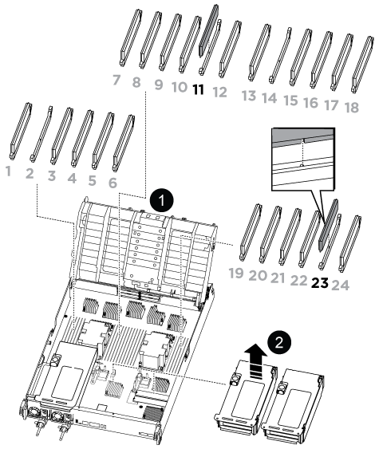

You must replace the NVDIMM in the controller module when your system registers that the flash lifetime is almost at an end or that the identified NVDIMM is not healthy in general; failure to do so causes a system panic.

All other components in the system must be functioning properly; if not, you must contact technical support.

You must replace the failed component with a replacement FRU component you received from your provider.

== Step 1: Shut down the impaired controller

include::../_include/shutdown_most_frus.adoc[]

== Step 2: Remove the controller module

You must remove the controller module from the chassis when you replace the controller module or replace a component inside the controller module.

. If you are not already grounded, properly ground yourself.
. Unplug the controller module power supplies from the source.
. Release the power cable retainers, and then unplug the cables from the power supplies.
. Loosen the hook and loop strap binding the cables to the cable management device, and then unplug the system cables and SFP and QSFP modules (if needed) from the controller module, keeping track of where the cables were connected.
+
Leave the cables in the cable management device so that when you reinstall the cable management device, the cables are organized.

. Remove the cable management device from the controller module and set it aside.
. Press down on both of the locking latches, and then rotate both latches downward at the same time.
+
The controller module moves slightly out of the chassis.
+
image::../media/drw_a800_pcm_remove.png[]
+
|===
a|
image:../media/legend_icon_01.png[Callout number 1]|
Locking latch
a|
image:../media/legend_icon_02.png[Callout number 2]
a|
Locking pin
|===

. Slide the controller module out of the chassis.
+
Make sure that you support the bottom of the controller module as you slide it out of the chassis.

. Place the controller module on a stable, flat surface, and then open the air duct:
 .. Press in the locking tabs on the sides of the air duct toward the middle of the controller module.
 .. Slide the air duct toward the fan modules, and then rotate it upward to its completely open position.

+
image::../media/drw_a800_open_air_duct.png[]

+

[cols="1,4"]
|===
a|
image:../media/legend_icon_01.png[Callout number 1]|
Air duct locking tabs
a|
image:../media/legend_icon_02.png[Callout number 2]
a|
Slide air duct towards fan modules
a|
image:../media/legend_icon_03.png[Callout number 3]
a|
Rotate air duct towards fan modules
|===

== Step 3: Replace the NVDIMM

To replace the NVDIMM, you must locate it in the controller module using the NVDIMM map label on top of the air duct, and then replace it following the specific sequence of steps.

. If you are removing or moving an NVDIMM, unlock the locking latch on the riser, and then remove the applicable riser.
+

+
[cols="1,4"]
|===
a|
image:../media/legend_icon_01.png[Callout number 1]|
Air duct cover
a|
image:../media/legend_icon_02.png[Callout number 2]
a|
Riser 2 and NVDIMM 11
a|
Riser 3 and NVDIMM 23
|===

. Note the orientation of the NVDIMM in the socket so that you can insert the NVDIMM in the replacement controller module in the proper orientation.
. Eject the NVDIMM from its slot by slowly pushing apart the two NVDIMM ejector tabs on either side of the NVDIMM, and then slide the NVDIMM out of the socket and set it aside.
+
NOTE: Carefully hold the NVDIMM by the edges to avoid pressure on the components on the NVDIMM circuit board.

. Remove the replacement NVDIMM from the antistatic shipping bag, hold the NVDIMM by the corners, and then align it to the slot.
+
The notch among the pins on the NVDIMM should line up with the tab in the socket.

. Locate the slot where you are installing the NVDIMM.
. Insert the NVDIMM squarely into the slot.
+
The NVDIMM fits tightly in the slot, but should go in easily. If not, realign the NVDIMM with the slot and reinsert it.
+
NOTE: Visually inspect the NVDIMM to verify that it is evenly aligned and fully inserted into the slot.

. Push carefully, but firmly, on the top edge of the NVDIMM until the ejector tabs snap into place over the notches at the ends of the NVDIMM.
. Reinstall any risers that you removed from the controller module.
. Close the air duct.

== Step 4: Reinstall the controller module and booting the system

After you replace a FRU in the controller module, you must reinstall the controller module and reboot it.

. If you have not already done so, close the air duct:
 .. Swing the air duct all the way down to the controller module.
 .. Slide the air duct toward the risers until the locking tabs click into place.
 .. Inspect the air duct to make sure that it is properly seated and locked into place.
+
image::../media/drw_a700s_close_air_duct.png[]
+
[cols="1,4"]
|===
a|
image:../media/legend_icon_01.png[Callout number 1]|
Locking tabs
a|
image:../media/legend_icon_02.png[Callout number 2]
a|
Slide plunger
|===
. Align the end of the controller module with the opening in the chassis, and then gently push the controller module halfway into the system.
+
NOTE: Do not completely insert the controller module in the chassis until instructed to do so.

. Recable the system, as needed.
+
If you removed the media converters (QSFPs or SFPs), remember to reinstall them if you are using fiber optic cables.

. Plug the power cord into the power supply, reinstall the power cable locking collar, and then connect the power supply to the power source.
. Complete the reinstallation of the controller module:
 .. Firmly push the controller module into the chassis until it meets the midplane and is fully seated.
+
The locking latches rise when the controller module is fully seated.
+
NOTE: Do not use excessive force when sliding the controller module into the chassis to avoid damaging the connectors.
+
The controller module begins to boot as soon as it is fully seated in the chassis.

 .. Rotate the locking latches upward, tilting them so that they clear the locking pins, and then lower them into the locked position.
 .. If you have not already done so, reinstall the cable management device.

== Step 4: Return the failed part to NetApp

include::../_include/complete_rma.adoc[]
