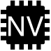

= Replace a DIMM - AFF A200
:icons: font
:imagesdir: ../media/

[.lead]
You must replace a DIMM in the controller module when your system registers an increasing number of correctable error correction codes (ECC); failure to do so causes a system panic.

.About this task
* All other components in the system must be functioning properly; if not, you must contact technical support.
* You must replace the failed component with a replacement FRU component you received from your provider.

== Step 1: Shut down the impaired controller

include::../_include/shutdown_no_mcc.adoc[]

. If the system has only one controller module in the chassis, turn off the power supplies, and then unplug the impaired controller's power cords from the power source.

== Step 2: Remove controller module

To access components inside the controller, you must first remove the controller module from the system and then remove the cover on the controller module.

. If you are not already grounded, properly ground yourself.
. Loosen the hook and loop strap binding the cables to the cable management device, and then unplug the system cables and SFPs (if needed) from the controller module, keeping track of where the cables were connected.
+
Leave the cables in the cable management device so that when you reinstall the cable management device, the cables are organized.

. Remove and set aside the cable management devices from the left and right sides of the controller module.
+
image::../media/drw_25xx_cable_management_arm.png[]

. Squeeze the latch on the cam handle until it releases, open the cam handle fully to release the controller module from the midplane, and then, using two hands, pull the controller module out of the chassis.
+
image::../media/drw_2240_x_opening_cam_latch.png[]

. Turn the controller module over and place it on a flat, stable surface.
. Open the cover by sliding in the blue tabs to release the cover, and then swing the cover up and open.
+
image::../media/drw_2600_opening_pcm_cover.png[]

== Step 3: Replace the DIMMs

To replace the DIMMs, locate them inside the controller and follow the specific sequence of steps.

.About this task
If you are replacing a DIMM, you need to remove it after you have unplugged the NVMEM battery from the controller module.

.Steps
. If you are not already grounded, properly ground yourself.
. Check the NVMEM LED on the controller module.
+
You must perform a clean system shutdown before replacing system components to avoid losing unwritten data in the nonvolatile memory (NVMEM). The LED is located on the back of the controller module. Look for the following icon:
+

. If the NVMEM LED is not flashing, there is no content in the NVMEM; you can skip the following steps and proceed to the next task in this procedure.
. If the NVMEM LED is flashing, there is data in the NVMEM and you must disconnect the battery to clear the memory:
 .. Locate the battery, press the clip on the face of the battery plug to release the lock clip from the plug socket, and then unplug the battery cable from the socket.
+
image::../media/drw_2600_nvmem_battery_unplug.png[]

 .. Confirm that the NVMEM LED is no longer lit.
 .. Reconnect the battery connector.
. Return to step 2 of this procedure to recheck the NVMEM LED.
. Locate the DIMMs on your controller module.
. Note the orientation of the DIMM in the socket so that you can insert the replacement DIMM in the proper orientation.
. Eject the DIMM from its slot by slowly pushing apart the two DIMM ejector tabs on either side of the DIMM, and then slide the DIMM out of the slot.
+
NOTE: Carefully hold the DIMM by the edges to avoid pressure on the components on the DIMM circuit board.
+
The number and placement of system DIMMs depends on the model of your system.
+
The following illustration shows the location of system DIMMs:
+
image::../media/drw_2600_dimm_repl_animated_gif.png[]

. Remove the replacement DIMM from the antistatic shipping bag, hold the DIMM by the corners, and align it to the slot.
+
The notch among the pins on the DIMM should line up with the tab in the socket.

. Make sure that the DIMM ejector tabs on the connector are in the open position, and then insert the DIMM squarely into the slot.
+
The DIMM fits tightly in the slot, but should go in easily. If not, realign the DIMM with the slot and reinsert it.
+
NOTE: Visually inspect the DIMM to verify that it is evenly aligned and fully inserted into the slot.

. Push carefully, but firmly, on the top edge of the DIMM until the ejector tabs snap into place over the notches at the ends of the DIMM.
. Locate the NVMEM battery plug socket, and then squeeze the clip on the face of the battery cable plug to insert it into the socket.
+
Make sure that the plug locks down onto the controller module.

. Close the controller module cover.

== Step 4: Reinstall the controller module

After you replace components in the controller module, reinstall it into the chassis.

. If you are not already grounded, properly ground yourself.
. If you have not already done so, replace the cover on the controller module.
. Align the end of the controller module with the opening in the chassis, and then gently push the controller module halfway into the system.
+
NOTE: Do not completely insert the controller module in the chassis until instructed to do so.

. Recable the system, as needed.
+
If you removed the media converters (QSFPs or SFPs), remember to reinstall them if you are using fiber optic cables.

. Complete the reinstallation of the controller module:

[options="header" cols="1,3"]
|===
| If your system is in...| Then perform these steps...
a|
An HA pair
a|
The controller module begins to boot as soon as it is fully seated in the chassis.

 .. With the cam handle in the open position, firmly push the controller module in until it meets the midplane and is fully seated, and then close the cam handle to the locked position.
+
CAUTION: Do not use excessive force when sliding the controller module into the chassis to avoid damaging the connectors.
+
The controller begins to boot as soon as it is seated in the chassis.

 .. If you have not already done so, reinstall the cable management device.
 .. Bind the cables to the cable management device with the hook and loop strap.

a|
A stand-alone configuration
a|

 .. With the cam handle in the open position, firmly push the controller module in until it meets the midplane and is fully seated, and then close the cam handle to the locked position.
+
NOTE: Do not use excessive force when sliding the controller module into the chassis to avoid damaging the connectors.

 .. If you have not already done so, reinstall the cable management device.
 .. Bind the cables to the cable management device with the hook and loop strap.
 .. Reconnect the power cables to the power supplies and to the power sources, then turn on the power to start the boot process. 

|===

== Step 5: Return the failed part to NetApp

include::../_include/complete_rma.adoc[]
