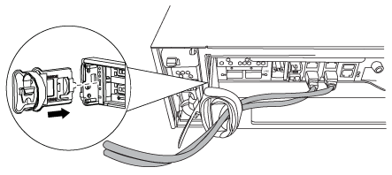
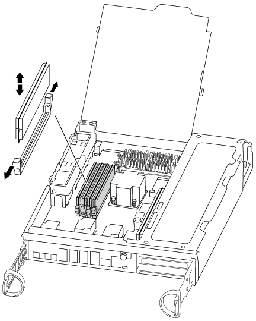

= Replace a DIMM - AFF A300
:icons: font
:imagesdir: ../media/

[.lead]
You must replace a DIMM in the controller module when your system registers an increasing number of correctable error correction codes (ECC); failure to do so causes a system panic.

All other components in the system must be functioning properly; if not, you must contact technical support.

You must replace the failed component with a replacement FRU component you received from your provider.

== Step 1: Shut down the impaired controller

Shut down or take over the impaired controller using the appropriate procedure for your configuration.

[role="tabbed-block"]
====

.Option 1: Most configurations

--

include::../_include/shutdown_most_frus.adoc[]

--

.Option 2: Controller is in a two-node MetroCluster

--
include::../_include/shutdown_2n_mcc.adoc[]
--
====

== Step 2: Open the controller module

To access components inside the controller, you must first remove the controller module from the system and then remove the cover on the controller module.

. If you are not already grounded, properly ground yourself.
. Loosen the hook and loop strap binding the cables to the cable management device, and then unplug the system cables and SFPs (if needed) from the controller module, keeping track of where the cables were connected.
+
Leave the cables in the cable management device so that when you reinstall the cable management device, the cables are organized.

. Remove and set aside the cable management devices from the left and right sides of the controller module.
+

. Loosen the thumbscrew on the cam handle on the controller module.
+
image::../media/drw_8020_cam_handle_thumbscrew.png[]
+
|===
a|
image:../media/legend_icon_01.png[]|
Thumbscrew
a|
image:../media/legend_icon_02.png[]
a|
Cam handle
|===

. Pull the cam handle downward and begin to slide the controller module out of the chassis.
+
Make sure that you support the bottom of the controller module as you slide it out of the chassis.

== Step 3: Replace the DIMMs

To replace the DIMMs, locate them inside the controller and follow the specific sequence of steps.

. If you are not already grounded, properly ground yourself.
. Check the NVMEM LED on the controller module.
+
You must perform a clean system shutdown before replacing system components to avoid losing unwritten data in the nonvolatile memory (NVMEM). The LED is located on the back of the controller module. Look for the following icon:
+
image::../media/drw_hw_nvram_icon.png[]

. If the NVMEM LED is not flashing, there is no content in the NVMEM; you can skip the following steps and proceed to the next task in this procedure.
. Unplug the battery:
+
NOTE: The NVMEM LED blinks while destaging contents to the flash memory when you halt the system. After the destage is complete, the LED turns off.

 ** If power is lost without a clean shutdown, the NVMEM LED flashes until the destage is complete, and then the LED turns off.
 ** If the LED is on and power is on, unwritten data is stored on NVMEM.
+
This typically occurs during an uncontrolled shutdown after Data ONTAP has successfully booted.

 .. Open the CPU air duct and locate the NVMEM battery.
+
image::../media/drw_rxl_nvmem_battery.png[]
+
|===
a|
image:../media/legend_icon_01.png[]|
NVMEM battery lock tab
a|
image:../media/legend_icon_02.png[]
a|
NVMEM battery
|===

 .. Locate the battery plug and squeeze the clip on the face of the battery plug to release the plug from the socket, and then unplug the battery cable from the socket.
 .. Wait a few seconds, and then plug the battery back into the socket.

. Return to step 2 of this procedure to recheck the NVMEM LED.
. Locate the DIMMs on your controller module.
. Note the orientation of the DIMM in the socket so that you can insert the replacement DIMM in the proper orientation.
. Eject the DIMM from its slot by slowly pushing apart the two DIMM ejector tabs on either side of the DIMM, and then slide the DIMM out of the slot.
+
NOTE: Carefully hold the DIMM by the edges to avoid pressure on the components on the DIMM circuit board.
+
The number and placement of system DIMMs depends on the model of your system.
+
The following illustration shows the location of system DIMMs:
+

. Remove the replacement DIMM from the antistatic shipping bag, hold the DIMM by the corners, and align it to the slot.
+
The notch among the pins on the DIMM should line up with the tab in the socket.

. Make sure that the DIMM ejector tabs on the connector are in the open position, and then insert the DIMM squarely into the slot.
+
The DIMM fits tightly in the slot, but should go in easily. If not, realign the DIMM with the slot and reinsert it.
+
NOTE: Visually inspect the DIMM to verify that it is evenly aligned and fully inserted into the slot.

. Push carefully, but firmly, on the top edge of the DIMM until the ejector tabs snap into place over the notches at the ends of the DIMM.
. Locate the NVMEM battery plug socket, and then squeeze the clip on the face of the battery cable plug to insert it into the socket.
+
Make sure that the plug locks down onto the controller module.

. Close the controller module cover.

== Step 4: Reinstall the controller

After you replace a component within the controller module, you must reinstall the controller module in the system chassis.

. If you are not already grounded, properly ground yourself.
. Align the end of the controller module with the opening in the chassis, and then gently push the controller module halfway into the system.
+
NOTE: Do not completely insert the controller module in the chassis until instructed to do so.

. Recable the system, as needed.
+
If you removed the media converters (QSFPs or SFPs), remember to reinstall them if you are using fiber optic cables.

. Complete the reinstallation of the controller module:
+
The controller module begins to boot as soon as it is fully seated in the chassis.

 .. With the cam handle in the open position, firmly push the controller module in until it meets the midplane and is fully seated, and then close the cam handle to the locked position.
+
NOTE: Do not use excessive force when sliding the controller module into the chassis to avoid damaging the connectors.

 .. Tighten the thumbscrew on the cam handle on back of the controller module.
 .. If you have not already done so, reinstall the cable management device.
 .. Bind the cables to the cable management device with the hook and loop strap.

== Step 5: (Two-node MetroCluster only): Switch back aggregates

include::../_include/2n_mcc_switchback.adoc[]

== Step 6: Return the failed part to NetApp

include::../_include/complete_rma.adoc[]
