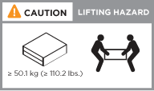
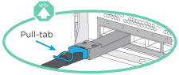
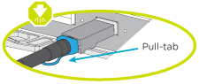
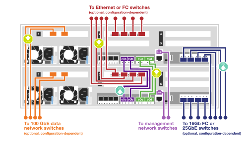
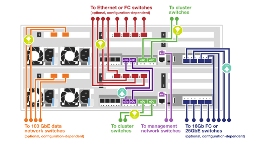
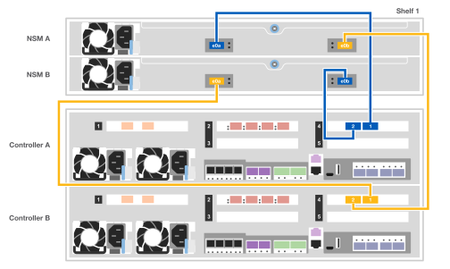
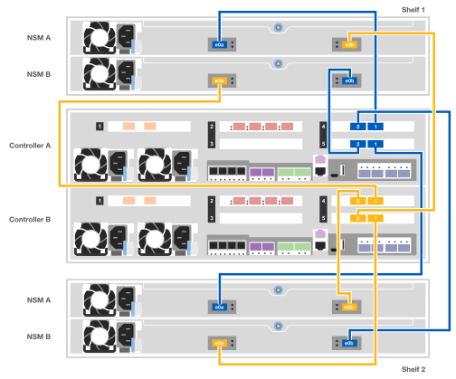

= Detailed guide - AFF C400
:icons: font
:imagesdir: ../media/

[.lead]
This guide gives detailed step-by-step instructions for installing a typical NetApp system. Use this guide if you want more detailed installation instructions.

If you have a MetroCluster configuration, use the MetroCluster installation content.

https://docs.netapp.com/us-en/ontap-metrocluster/index.html[MetroCluster Documentation^]

== Step 1: Prepare for installation

To install your system, you need to create an account, register the system, and get license keys. You also need to inventory the appropriate number and type of cables for your system and collect specific network information.

.Before you begin

* You need to have access to the Hardware Universe for information about site requirements as well as additional information on your configured system. You might also want to have access to the Release Notes for your version of ONTAP for more information about this system.
+
https://hwu.netapp.com[NetApp Hardware Universe]
+
http://mysupport.netapp.com/documentation/productlibrary/index.html?productID=62286[Find the Release Notes for your version of ONTAP 9]

* You need to provide the following at your site:

** Rack space for the storage system
** Phillips #2 screwdriver
** Additional networking cables to connect your system to your network switch and laptop or console with a Web browser

.Steps
. Unpack the contents of all boxes.
. Record the system serial number from the controllers.
+
image::../media/drw_ssn_label.png[]

. Inventory and make a note of the number and types of cables you received.
+
The following table identifies the types of cables you might receive. If you receive a cable not listed in the table, see the Hardware Universe to locate the cable and identify its use.
+
https://hwu.netapp.com[NetApp Hardware Universe]
+
[options="header" cols="1,2,1,2"]
|===
| Type of cable...| Part number and length| Connector type| For...
a|
100 GbE cable (QSFP28)
a|
X66211A-05 (112-00595), 0.5m

X66211A-1 (112-00573), 1m

X66211A-2 (112-00574), 2m

X66211A-5 (112-00574), 5m
a|

a|
Storage, cluster interconnect/HA, and Ethernet data (order-dependent)
a|
25 GbE cable (SFP28)
a|
X66240-2 (112-00598), 2m

X66240-5 (112-00639), 5m
a|

a|
GbE network connection (order-dependent)
a|
32 Gb FC (SFP+ Op)
a|
X66250-2 (112-00342), 2m

X66250-5 (112-00344), 5m

X66250-15 (112-00346), 15m
a|

[]
a|
FC network connection
a|
Optical cables
a|
X66250-2-N-C (112-00342)
a|

a|
16 Gb FC or 25GbE cables for mezzanine cards (order-dependent)
a|
RJ-45 (order dependent)
a|
X6585-R6 (112-00291), 3m

X6562-R6 (112-00196), 5m
a|

a|
Management network
a|
Micro-USB console cable
a|
Not applicable
a|

a|
Console connection used during software setup if laptop or console does not support network discovery.
a|
Power cables
a|
Not applicable
a|

a|
Powering up the system
|===

. Review the _NetApp ONTAP Configuration Guide_ and collect the required information listed in that guide.
+
https://library.netapp.com/ecm/ecm_download_file/ECMLP2862613[ONTAP Configuration Guide]

== Step 2: Install the hardware

You need to install your system in a 4-post rack or NetApp system cabinet, as applicable.

. Install the rail kits, as needed.
. Install and secure your system using the instructions included with the rail kit.
+
NOTE: You need to be aware of the safety concerns associated with the weight of the system.
+

. Attach cable management devices (as shown).
+
image::../media/drw_a320_cable_management_arms.png[]

. Place the bezel on the front of the system.

== Step 3: Cable controllers to your network

You can cable the controllers to your network by using the two-node switchless cluster method or by using the switched cluster method.

.About this task
* If the port labels on the card are not visible, you can identify the ports by checking the card installation orientation (for C400, the PCIe connector socket is on the left side of the card slot), and then look for the card by part number in NetApp Hardware Universe, which shows a graphic of the bezel with the port labels. You can find the card part number using the sysconfig -a command or on the system packing list.
* If you are cabling an MetroCluster IP configuration, ports e0a/e0b are available for hosting data LIFs (usually in Default IPSpace).

// start tabbed area

[role="tabbed-block"]
====

.Option 1: Cable a two-node switchless cluster
--
A controller module's cluster interconnect and HA ports are cabled to its partner controller module. The optional data ports, optional NIC cards, and management ports on the controller modules are connected to switches.

.Before you begin
You must have contacted your network administrator for information about connecting the system to the switches.

.About this task
Be sure to check the direction of the cable pull-tabs when inserting the cables in the ports. Cable pull-tabs are up for all onboard ports and down for expansion (NIC) cards.

NOTE: As you insert the connector, you should feel it click into place; if you do not feel it click, remove it, turn it around and try again.

.Steps
. Use the illustration to complete the cabling between the controllers and the switches:
+

. Go to <<Step 4: Cable controllers to drive shelves>> for drive shelf cabling instructions.

--

.Option 2: Cable a switched cluster
--
Controller module cluster interconnect and HA ports are cabled to the cluster/HA switch. The optional data ports, optional NIC cards, mezzanine cards, and management ports are connected to switches. 

.Before you begin
You must have contacted your network administrator for information about connecting the system to the switches.

.About this task
Be sure to check the direction of the cable pull-tabs when inserting the cables in the ports. Cable pull-tabs are up for all onboard ports and down for expansion (NIC) cards.

NOTE: As you insert the connector, you should feel it click into place; if you do not feel it click, remove it, turn it around and try again.

.Steps
. Use the illustration to complete the cabling between the controllers and the switches:
+

. Go to <<Step 4: Cable controllers to drive shelves>> for drive shelf cabling instructions.

--
====
// end tabbed area

== Step 4: Cable controllers to drive shelves

The following options show you how to cable one or two NS224 drive shelves to your system.

=== Option 1: Cable the controllers to a single drive shelf

You must cable each controller to the NSM modules on the NS224 drive shelf.

.About this task
Be sure to check the illustration arrow for the proper cable connector pull-tab orientation. The cable pull-tab for the NS224 are up.

NOTE: As you insert the connector, you should feel it click into place; if you do not feel it click, remove it, turn it around and try again.

.Steps
. Use the following illustration to cable your controllers to a single drive shelf.
+

. Go to <<Step 5: Complete system setup and configuration>> to complete system setup and configuration.

=== Option 2: Cable the controllers to two drive shelves

You must cable each controller to the NSM modules on both NS224 drive shelves.

.About this task
Be sure to check the illustration arrow for the proper cable connector pull-tab orientation. The cable pull-tab for the NS224 are up.

NOTE: As you insert the connector, you should feel it click into place; if you do not feel it click, remove it, turn it around and try again.

.Steps
. Use the following illustration to cable your controllers to two drive shelves.
+

. Go to <<Step 5: Complete system setup and configuration>> to complete system setup and configuration.

== Step 5: Complete system setup and configuration

You can complete the system setup and configuration using cluster discovery with only a connection to the switch and laptop, or by connecting directly to a controller in the system and then connecting to the management switch.

=== Option 1: Completing system setup and configuration if network discovery is enabled

If you have network discovery enabled on your laptop, you can complete system setup and configuration using automatic cluster discovery.

. Use the following animation to power on and set shelf IDs for one or more drive shelves:
+
For NS224 drive shelves, shelf IDs are pre-set to 00 and 01. If you want to change the shelf IDs, use the straightened end of a paperclip, or narrow tipped ball point pen to access the shelf ID button behind the faceplate.
+
video::c500e747-30f8-4763-9065-afbf00008e7f[panopto, title="Animation - Set drive shelf IDs"]

. Plug the power cords into the controller power supplies, and then connect them to power sources on different circuits.
. Make sure that your laptop has network discovery enabled.
+
See your laptop's online help for more information.

. Use the following animation to connect your laptop to the Management switch.
+
video::d61f983e-f911-4b76-8b3a-ab1b0066909b[panopto, title="Animation - Connect your laptop to the Management switch"]

. Select an ONTAP icon listed to discover:
+
image::../media/drw_autodiscovery_controler_select.png[]

 .. Open File Explorer.
 .. Click network in the left pane.
 .. Right click and select refresh.
 .. Double-click either ONTAP icon and accept any certificates displayed on your screen.
+
NOTE: XXXXX is the system serial number for the target node.

+
System Manager opens.

. Use System Manager guided setup to configure your system using the data you collected in the _NetApp ONTAP Configuration Guide_.
+
https://library.netapp.com/ecm/ecm_download_file/ECMLP2862613[ONTAP Configuration Guide]

. Set up your account and download Active IQ Config Advisor:
 .. Log in to your existing account or create an account.
+
https://mysupport.netapp.com/site/user/registration[NetApp Support Registration]

 .. Register your system.
+
https://mysupport.netapp.com/site/systems/register[NetApp Product Registration]

 .. Download Active IQ Config Advisor.
+
https://mysupport.netapp.com/site/tools[NetApp Downloads: Config Advisor]

. Verify the health of your system by running Config Advisor.
. After you have completed the initial configuration, go to the https://www.netapp.com/data-management/oncommand-system-documentation/[ONTAP & ONTAP System Manager Documentation Resources] page for information about configuring additional features in ONTAP.

=== Option 2: Completing system setup and configuration if network discovery is not enabled

If network discovery is not enabled on your laptop, you must complete the configuration and setup using this task.

. Cable and configure your laptop or console:
 .. Set the console port on the laptop or console to 115,200 baud with N-8-1.
+
NOTE: See your laptop or console's online help for how to configure the console port.

 .. Connect the console cable to the laptop or console using the console cable that came with your system, and then connect the laptop to the management switch on the management subnet .
 .. Assign a TCP/IP address to the laptop or console, using one that is on the management subnet.
. Use the following animation to power on and set shelf IDs for one or more drive shelves:
+
For NS224 drive shelves, shelf IDs are pre-set to 00 and 01. If you want to change the shelf IDs, use the straightened end of a paperclip, or narrow tipped ball point pen to access the shelf ID button behind the faceplate.
+
video::c500e747-30f8-4763-9065-afbf00008e7f[panopto, title="Animation - Set drive shelf IDs"]

. Plug the power cords into the controller power supplies, and then connect them to power sources on different circuits.
+
NOTE: Initial booting may take up to eight minutes.

. Assign an initial node management IP address to one of the nodes.
+
[options="header" cols="1,2"]
|===
| If the management network has DHCP...| Then...
a|
Configured
a|
Record the IP address assigned to the new controllers.
a|
Not configured
a|

 .. Open a console session using PuTTY, a terminal server, or the equivalent for your environment.
+
NOTE: Check your laptop or console's online help if you do not know how to configure PuTTY.

 .. Enter the management IP address when prompted by the script.

+
|===

. Using System Manager on your laptop or console, configure your cluster:
 .. Point your browser to the node management IP address.
+
NOTE: The format for the address is +https://x.x.x.x.+

 .. Configure the system using the data you collected in the _NetApp ONTAP Configuration guide_.
+
https://library.netapp.com/ecm/ecm_download_file/ECMLP2862613[ONTAP Configuration Guide]

. Set up your account and download Active IQ Config Advisor:
 .. Log in to your existing account or create an account.
+
https://mysupport.netapp.com/site/user/registration[NetApp Support Registration]

 .. Register your system.
+
https://mysupport.netapp.com/site/systems/register[NetApp Product Registration]

 .. Download Active IQ Config Advisor.
+
https://mysupport.netapp.com/site/tools[NetApp Downloads: Config Advisor]
. Verify the health of your system by running Config Advisor.
. After you have completed the initial configuration, go to the https://www.netapp.com/data-management/oncommand-system-documentation/[ONTAP & ONTAP System Manager Documentation Resources] page for information about configuring additional features in ONTAP.
