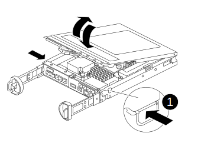
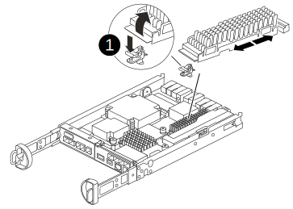

= Replace the caching module - FAS2800
:icons: font
:imagesdir: ../media/

[.lead]
You must replace the caching module in the controller module when your system registers a single AutoSupport (ASUP) message that the module has gone offline; failure to do so results in performance degradation.

* You must replace the failed component with a replacement FRU component you received from your provider.

== Step 1: Shut down the impaired controller

To shut down the impaired controller, you must determine the status of the controller and, if necessary, take over the controller so that the healthy controller continues to serve data from the impaired controller storage.

.About this task
If you have a cluster with more than two nodes, it must be in quorum. If the cluster is not in quorum or a healthy controller shows false for eligibility and health, you must correct the issue before shutting down the impaired controller.

http://docs.netapp.com/ontap-9/topic/com.netapp.doc.dot-cm-sag/home.html[ONTAP 9 System Administration Reference^]

You might want to erase the contents of your caching module before replacing it.

.Steps
. Although data on the caching module is encrypted, you might want to erase any data from the impaired caching module and verify that the caching module has no data:
.. Erase the data on the caching module: `system controller flash-cache secure-erase run -node _node name_ localhost -device-id _device_number_`
+
NOTE: Run the `system controller flash-cache show` command if you don't know the flashcache device ID.
+
.. Verify that the data has been erased from the caching module: `system controller flash-cache secure-erase show`
+
The output should display the caching module status as erased.
. If AutoSupport is enabled, suppress automatic case creation by invoking an AutoSupport message: `system node autosupport invoke -node * -type all -message MAINT=number_of_hours_downh`
+
The following AutoSupport message suppresses automatic case creation for two hours: `cluster1:*> system node autosupport invoke -node * -type all -message MAINT=2h`
. If the impaired controller is part of an HA pair, disable automatic giveback from the console of the healthy controller: `storage failover modify -node local -auto-giveback false`

. Take the impaired controller to the LOADER prompt:
+
[options="header" cols="1,2"]
|===
| If the impaired controller is displaying...| Then...
a|
The LOADER prompt
a|
Go to the next step.
a|
Waiting for giveback...
a|
Press Ctrl-C, and then respond `y` when prompted.
a|
System prompt or password prompt (enter system password)
a|
Take over or halt the impaired controller:

 ** For an HA pair, take over the impaired controller from the healthy controller: `storage failover takeover -ofnode _impaired_node_name_`
+
When the impaired controller shows Waiting for giveback..., press Ctrl-C, and then respond `y`.

 ** For a stand-alone system: `system node halt _impaired_node_name_`

|===

== Step 2: Remove controller module

Remove the controller module from the system and then remove the cover on the controller module.

.Steps
. If you are not already grounded, properly ground yourself.
. Loosen the hook and loop strap binding the cables to the cable management device, and then unplug the system cables and SFPs (if needed) from the controller module, keeping track of where the cables were connected.
+
Leave the cables in the cable management device so that when you reinstall the cable management device, the cables are organized.

. Remove and set aside the cable management devices from the left and right sides of the controller module.

. Squeeze the latch on the cam handle until it releases, open the cam handle fully to release the controller module from the midplane, and then, using two hands, pull the controller module out of the chassis.
+
image::../media/drw_2240_x_opening_cam_latch.svg[width=500px]

. Turn the controller module over and place it on a flat, stable surface.
. Open the cover by pressing the blue buttons on the sides of the controller module to release the cover, and then rotate the cover up and off of the controller module.
+

[cols="1,3"]
|===

a|
image::../media/legend_icon_01.svg[width=20px]
a|
Controller module cover release button

|===

== Step 3: Replace a caching module

Locate the caching module inside the controller, remove the failed caching module and replace it.

video::12b339c5-640a-4be8-a5fc-af47017276fd[panopto, title="Animation - Replace the caching module"]

Your storage system must meet certain criteria depending on your situation:

* It must have the appropriate operating system for the caching module you are installing.
* It must support the caching capacity.
* All other components in the storage system must be functioning properly; if not, you must contact technical support.

.Steps
. If you are not already grounded, properly ground yourself.
. Locate the failed caching module near the rear of the controller module and remove it.
 .. Press the blue release button and rotate the caching module upward.
 .. Gently pull the caching module straight out of the housing.
+

+
[cols="1,3"]
|===

a|
image::../media/legend_icon_01.svg[width=20px]
a|
Caching module release button

|===

. Align the edges of the replacement caching module with the socket in the housing, and then gently push it into the socket.
. Verify that the caching module is seated squarely and completely in the socket.
+
If necessary, remove the caching module and reseat it into the socket.

. Push the blue locking button, rotate the caching module all the way down, and then release the locking button to lock the caching module in place.
. Reinstall the controller module cover and lock it into place.

== Step 4: Reinstall the controller module

Reinstall the controller module into the chassis.

.Steps
. If you are not already grounded, properly ground yourself.
. If you have not already done so, replace the cover on the controller module.
. Turn the controller module over and align the end with the opening in the chassis.
. Gently push the controller module halfway into the system.
+
NOTE: Do not completely insert the controller module in the chassis until instructed to do so.

. Recable the system, as needed.
+
If you removed the media converters (QSFPs or SFPs), remember to reinstall them if you are using fiber optic cables.

. Complete the reinstallation of the controller module:
 .. With the cam handle in the open position, firmly push the controller module in until it meets the midplane and is fully seated, and then close the cam handle to the locked position.

NOTE: Do not use excessive force when sliding the controller module into the chassis to avoid damaging the connectors.

The controller begins to boot as soon as it is completely seated in the chassis.

 .. If you have not already done so, reinstall the cable management device.
 .. Bind the cables to the cable management device with the hook and loop strap.
 
== Step 5: Restore automatic giveback and AutoSupport

Restore automatic giveback and AutoSupport if they have been disabled.

. Restore automatic giveback by using the `storage failover modify -node local -auto-giveback true` command.
. Restore Autosupport using the `system node autosupport invoke -node * -type all -message MAINT=END`

== Step 6: Return the failed part to NetApp

include::../_include/complete_rma.adoc[]
