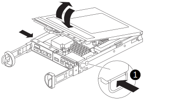
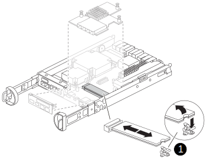

= Replace the controller module hardware - FAS2800
:icons: font
:imagesdir: ../media/

[.lead]
To replace the controller module hardware, you must remove the impaired controller, move FRU components to the replacement controller module, install the replacement controller module in the chassis, and then boot the system to Maintenance mode.

video::c83a3301-3161-4d65-86e8-af540147576a[panopto, title="Animation - Replace a controller module"]

== Step 1: Remove controller module

Remove the old controller module from the chassis.

. If you are not already grounded, properly ground yourself.
. Loosen the hook and loop strap binding the cables to the cable management device, and then unplug the system cables and SFPs (if needed) from the controller module, keeping track of where the cables were connected.
+
Leave the cables in the cable management device so that when you reinstall the cable management device, the cables are organized.

. Remove and set aside the cable management devices from the left and right sides of the controller module.
+

. If you left the SFP modules in the system after removing the cables, move them to the replacement controller module.
. Squeeze the latch on the cam handle until it releases, open the cam handle fully to release the controller module from the midplane, and then, using two hands, pull the controller module out of the chassis.
+
image::../media/drw_2240_x_opening_cam_latch.svg[width=340]

. Turn the controller module over and place it on a flat, stable surface.
. Open the cover by pressing the blue buttons on the sides of the controller module to release the cover, and then rotate the cover up and off of the controller module.
+

[cols="1,3"]
|===

a|
image::../media/legend_icon_01.svg[width=20px]
a|
Controller module cover release button

|===

== Step 2: Move the NVMEM battery

Remove the NVMEM battery from the old controller module and install it into the replacement controller module.

NOTE: Do not plug the NVMEM battery in until directed to do so.

[cols="1,3"]
|===

a|
image::../media/legend_icon_01.svg[width=20px]
a|
NVMEM battery release button
a|
image::../media/legend_icon_02.svg[width=20px]
a|
NVMEM battery plug

|===

. Unplug the battery plug by squeezing the clip on the face of the battery plug to release the plug from the socket, and then unplug the battery cable from the socket.
. Remove the battery from the controller module:
.. Press the blue button on the side of the controller module.
.. Slide the battery up until it clears the holding brackets, and then lift the battery out of the controller module.
. Move the battery to the replacement controller module and install it:
. Aligning the battery with the holding brackets on the sheet metal side wall.
. Slide the battery pack down until the battery latch engages and clicks into the opening on the side wall.
+
NOTE: Do not plug the battery in yet.  You will plug it in once the rest of the components are moved to the replacement controller module.

== Step 3:  Remove the mezzanine card 

Remove the mezzanine bezel and PCIe mezzanine card from the old controller module.

image::../media/drw_2850_replace_HIC_IEOPS-700.svg[width=500px]

[cols="1,3"]
|===

a|
image::../media/legend_icon_01.svg[width=20px]
a|
Riser bezel
a|
image::../media/legend_icon_02.svg[width=20px]
a|
PCIe mezzanine card

|===

. Remove the mezzanine card bezel by sliding it straight out from the controller module.
. Loosen the thumbscrews on the mezzanine card.  
+
NOTE: You can loosen the thumbscrews with your fingers or a screwdriver. 
+
. Lift the mezzanine card straight up and set it aside on an anti-static surface.  

== Step 4: Move the boot media

Remove the boot media from the old controller module and install it in the replacement controller module.

. After removing the mezzanine card, locate the boot media using the following illustration or the FRU map on the controller module:
+

[cols="1,3"]
|===

a|
image::../media/legend_icon_01.svg[width=20px]
a|
Boot media release button

|===

. Remove the boot media:
.. Press the blue button on the boot media housing to release the boot media from its housing.
.. Rotate the boot media up, and then gently pull it straight out of the boot media socket.
+
NOTE: Do not twist or pull the boot media straight up, because this could damage the socket or the boot media.

. Install the the boot media to the replacement controller module:
.. Align the edges of the replacement boot media with the boot media socket, and then gently push it into the socket.
.. Check the boot media to make sure that it is seated squarely and completely in the socket.
+
If necessary, remove the boot media and reseat it into the socket.
+
.. Rotate the boot media down and push it down to engage the locking button on the boot media housing.

== Step 5:  Install the mezzanine card in the replacement controller

Install the mezzanine card in the replacement controller module.

. Reinstall the mezzanine card:
.. Align mezzanine card with the socket on the motherboard. 
.. Gently push down on the card to seat the card in the socket.
.. Tighten the three thumbscrews on the mezzanine card.
. Reinstall th mezzanine card bezel.

== Step 6: Move the DIMMs

Remove the DIMMS from the old controller module and install them into the replacement controller module.

image::../media/drw_2850_replace_dimms_IEOPS-699.svg[width=s40]

[cols="1,3"]
|===

a|
image::../media/legend_icon_01.svg[width=20px]
a|
DIMM locking latches
a|
image::../media/legend_icon_02.svg[width=20px]
a|
DIMM

|===

. Locate the DIMMs on your controller module
NOTE: Note the location of the DIMM in the sockets so that you can insert the DIMM in the same location in the replacement controller module and in the proper orientation.
. Remove the DIMMs from the old controller module:
.. Eject the DIMM from its slot by slowly pushing apart the two DIMM ejector tabs on either side of the DIMM.
+
The DIMM socket will rotate up a little.
.. Rotate the DIMM socket as far as it will go, and then slide the DIMM out of the socket. 
+
NOTE: Carefully hold the DIMM by the edges to avoid pressure on the components on the DIMM circuit board.
.. Repeat these steps to remove additional DIMMs as needed.
. Verify that the NVMEM battery is not plugged into the replacement controller module.
. Install the DIMMs in the replacement controller in the same place they were in the failed controller:
.. Make sure that the DIMM ejector tabs on the connector are in the open position, and then insert the DIMM squarely into the slot.
+
The DIMM fits tightly in the slot, but should go in easily. If not, realign the DIMM with the slot and reinsert it.
+
NOTE: Visually inspect the DIMM to verify that it is evenly aligned and fully inserted into the slot.

.. Push carefully, but firmly, on the top edge of the DIMM until the ejector tabs snap into place over the notches at the ends of the DIMM.
.. Repeat these steps for the other DIMM.  
+
Make sure that the plug locks down onto the controller module.

== Step 7: Move a caching module

Remove the caching module from the old controller module install it into replacement controller module.

image::../media/drw_2850_replace_caching_module_IEOPS-697.svg[width=340px]

[cols="1,3"]
|===

a|
image::../media/legend_icon_01.svg[width=20px]
a|
Caching module locking button

|===

. Locate the caching module near the rear of the controller module and remove it:
.. Press the blue release button and rotate the caching module upward.
.. Gently pull the caching module straight out of the housing.
. Instal the caching module in the replacement controller module:
.. Align the edges of the caching module with the socket in the housing, and then gently push it into the socket.
.. Verify that the caching module is seated squarely and completely in the socket.
+
If necessary, remove the caching module and reseat it into the socket.
.. Rotate the caching module down to engage the blue locking button.
. Plug in the NVMEM battery.
+
Make sure that the plug locks down into the battery power socket on the motherboard. 
. Reinstall the controller module cover. 

== Step 8: Install the controller

Install the replacement controller module into the system chassis and boot ONTAP.

NOTE: The system might update system firmware when it boots. Do not abort this process. The procedure requires you to interrupt the boot process, which you can typically do at any time after prompted to do so. However, if the system updates the system firmware when it boots, you must wait until after the update is complete before interrupting the boot process.

. If you are not already grounded, properly ground yourself.
. If you have not already done so, replace the cover on the controller module.
. Turn the controller module. 
. Align the end of the controller module with the opening in the chassis, and then gently push the controller module halfway into the system.
+
NOTE: Do not completely insert the controller module in the chassis until instructed to do so.

. Cable the management and console ports only, so that you can access the system to perform the tasks in the following sections.
+
NOTE: You will connect the rest of the cables to the controller module later in this procedure.

+
. Complete the reinstallation of the controller module:
 .. With the cam handle in the open position, firmly push the controller module in until it meets the midplane and is fully seated, and then close the cam handle to the locked position.
+
NOTE: Do not use excessive force when sliding the controller module into the chassis to avoid damaging the connectors.
+
The controller begins to boot as soon as it is seated in the chassis.

 .. If you have not already done so, reinstall the cable management device.
 .. Bind the cables to the cable management device with the hook and loop strap.
 .. When you see the message `Press Ctrl-C for Boot Menu`, press `Ctrl-C` to interrupt the boot process.
+
NOTE: If you miss the prompt and the controller module boots to ONTAP, enter `halt`, and then at the LOADER prompt enter `boot_ontap`, press `Ctrl-C` when prompted, and then boot to Maintenance mode.
+
You must look for an Automatic firmware update console message. If the update message appears, do not press `Ctrl-C` to interrupt the boot process until after you see a message confirming that the update is complete.
+
Only press `Ctrl-C` when you see the message `Press Ctrl-C for Boot Menu`.
+
NOTE: If the firmware update is aborted, the boot process exits to the LOADER prompt. You must run the update_flash command and then exit LOADER and boot to Maintenance mode by pressing `Ctrl-C` when you see Starting AUTOBOOT press Ctrl-C to abort.
+
If you miss the prompt and the controller module boots to ONTAP, enter `halt`, and then at the LOADER prompt enter `boot_ontap`, press `Ctrl-C` when prompted, and then boot to Maintenance mode.

 .. Select the option to boot to Maintenance mode from the displayed menu.

*Important:* During the boot process, you might see the following prompts:

 ** A prompt warning of a system ID mismatch and asking to override the system ID.
 ** A prompt warning that when entering Maintenance mode in an HA configuration you must ensure that the healthy controller remains down.
You can safely respond `y` to these prompts.
