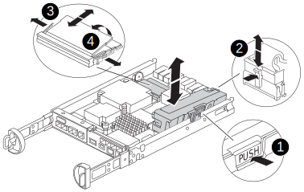

= Replace a DIMM - FAS2800
:icons: font
:imagesdir: ../media/

[.lead]
You must replace a DIMM in the controller module when your system registers an increasing number of correctable error correction codes (ECC); failure to do so causes a system panic.

All other components in the system must be functioning properly; if not, you must contact technical support.

You must replace the failed component with a replacement FRU component you received from your provider.

video::f2805d18-ab49-464c-b3bc-af470172547a[panopto, title="Animation - Replace a DIMM"]

== Step 1: Shut down the impaired controller

[.lead]
include::../_include/shutdown_no_mcc.adoc[]

== Step 2: Remove controller module

[.lead]
Remove the controller module from the system and then remove the controller module cover.

.Steps
. If you are not already grounded, properly ground yourself.
. Loosen the hook and loop strap binding the cables to the cable management device, and then unplug the system cables and SFPs (if needed) from the controller module, keeping track of where the cables were connected.
+
Leave the cables in the cable management device so that when you reinstall the cable management device, the cables are organized.

. Remove and set aside the cable management devices from the left and right sides of the controller module.
. Squeeze the latch on the cam handle until it releases, open the cam handle fully to release the controller module from the midplane, and then, using two hands, pull the controller module out of the chassis.
+
image::../media/drw_2240_x_opening_cam_latch.svg[width=340px]

. Turn the controller module over and place it on a flat, stable surface.
. Open the cover by pressing the blue buttons on the sides of the controller module to release the cover, and then rotate the cover up and off of the controller module.
+
image::../media/drw_2850_open_controller_module_cover_IEOPS-695.svg[width=340px]

[cols="1,3"]
|===

a|
image::../media/legend_icon_01.svg[width=20px]
a|
Controller module cover release button

|===

== Step 3: Replace the DIMMs

[.lead]
Locate the DIMM inside the controller, remove it, and replace it.

NOTE: Before replacing a DIMM, you need to unplugg the NVMEM battery from the controller module.

.Steps
. If you are not already grounded, properly ground yourself.
+
You must perform a clean system shutdown before replacing system components to avoid losing unwritten data in the nonvolatile memory (NVMEM). The LED is located on the back of the controller module. Look for the following icon:
+
image::../media/drw_hw_nvram_icon.svg[width=70px]

. If the NVMEM LED is not flashing, there is no content in the NVMEM; you can skip the following steps and proceed to the next task in this procedure.
. If the NVMEM LED is flashing, there is data in the NVMEM and you must disconnect the battery to clear the memory:
 .. Locate the battery cable, press the clip on the battery plug to release the lock clip from the plug socket, and then unplug the battery cable from the socket.
 .. Confirm that the NVMEM LED is no longer lit.
 .. Reconnect the battery connector and recheck the LED on the back of the controller.
 .. Unplug the battery cable.
. Locate the DIMMs on your controller module.
+
. Note the orientation and location of the DIMM in the socket so that you can insert the replacement DIMM in the proper orientation.
. Eject the DIMM from its slot by slowly pushing apart the two DIMM ejector tabs on either side of the DIMM, and then slide the DIMM out of the slot.
+
The DIMM socket will rotate up a little.
. Rotate the DIMM socket as far as it will go, and then slide the DIMM out of the socket. 
+
NOTE: Carefully hold the DIMM by the edges to avoid pressure on the components on the DIMM circuit board.
+

+
[cols="1,3"]
|===

a|
image::../media/legend_icon_01.svg[width=20px]
a|
DIMM locking latches
a|
image::../media/legend_icon_02.svg[width=20px]
a|
DIMM

|===

. Remove the replacement DIMM from the antistatic shipping bag, hold the DIMM by the corners, and align it to the slot.
+
The notch among the pins on the DIMM should line up with the tab in the socket.

. Make sure that the DIMM ejector tabs on the connector are in the open position, and then insert the DIMM squarely into the slot.
+
The DIMM fits tightly in the slot, but should go in easily. If not, realign the DIMM with the slot and reinsert it.
+
NOTE: Visually inspect the DIMM to verify that it is evenly aligned and fully inserted into the slot.

. Push carefully, but firmly, on the top edge of the DIMM until the ejector tabs snap into place over the notches at the ends of the DIMM.
. Plug in the NVMRM battery.
+
Make sure that the plug locks down into the battery power socket on the motherboard. 
+
. Reinstall the controller module cover.

== Step 4: Reinstall the controller module

[.lead]
Reinstall the controller module into the chassis.

.Steps
. If you are not already grounded, properly ground yourself.
. If you have not already done so, replace the cover on the controller module.
. Turn the controller module over and align the end with the opening in the chassis.
. Gently push the controller module halfway into the system.Align the end of the controller module with the opening in the chassis, and then gently push the controller module halfway into the system.
+
NOTE: Do not completely insert the controller module in the chassis until instructed to do so.

. Recable the system, as needed.
+
If you removed the media converters (QSFPs or SFPs), remember to reinstall them if you are using fiber optic cables.

. Complete the reinstallation of the controller module:
 .. With the cam handle in the open position, firmly push the controller module in until it meets the midplane and is fully seated, and then close the cam handle to the locked position.
+
NOTE: Do not use excessive force when sliding the controller module into the chassis to avoid damaging the connectors.
+
The controller begins to boot as soon as it is seated in the chassis.

 .. If you have not already done so, reinstall the cable management device.
 .. Bind the cables to the cable management device with the hook and loop strap.
 .. When you see the message `Press Ctrl-C for Boot Menu`, press `Ctrl-C` to interrupt the boot process.
+
NOTE: If you miss the prompt and the controller module boots to ONTAP, enter `halt`, and then at the LOADER prompt enter `boot_ontap`, press `Ctrl-C` when prompted, and then boot to Maintenance mode.

 .. Select the option to boot to Maintenance mode from the displayed menu.

== Step 5: Run diagnostics

[.lead]
After you have replaced a system DIMM in your system, you should run diagnostic tests on that component.

Your system must be at the LOADER prompt to start diagnostics.

All commands in the diagnostic procedures are issued from the controller where the component is being replaced.

.Steps
. If the controller to be serviced is not at the LOADER prompt, perform the following steps:
 .. Select the Maintenance mode option from the displayed menu.
 .. After the controller boots to Maintenance mode, halt the controller: `halt`
+
After you issue the command, you should wait until the system stops at the LOADER prompt.
+
NOTE: During the boot process, you can safely respond `y` to prompts.

  *** A prompt warning that when entering Maintenance mode in an HA configuration, you must ensure that the healthy controller remains down.

. At the LOADER prompt, access the special drivers specifically designed for diagnostics to function properly: `boot_diags`
. Select *Scan System* from the displayed menu to enable running the diagnostics tests.
. Select *Test Memory* from the displayed menu.
. Select an option from the displayed sub-menu and run the test.
. Proceed based on the result of the preceding step:
 ** If the test failed, correct the failure, and then rerun the test.
 ** If the test reported no failures, select Reboot from the menu to reboot the system.

== Step 6: Restore automatic giveback and AutSupport

[.lead]
After completing diagnostics and rebooting the node, you need to restore automatic giveback and AutoSupport if they have been disabled.

. Restore automatic giveback by using the `storage failover modify -node local -auto-giveback true` command.
. Restore Autosupport using the `system node autosupport invoke -node * -type all -message MAINT=END`

== Step 7: Return the failed part to NetApp

[.lead]
include::../_include/complete_rma.adoc[]
