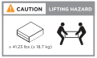
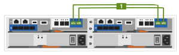
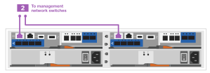
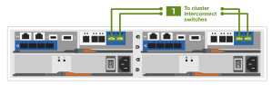
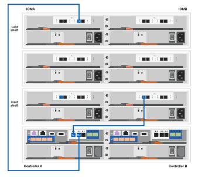
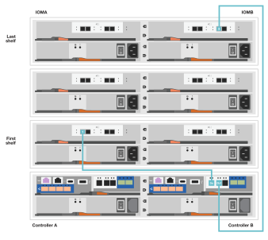
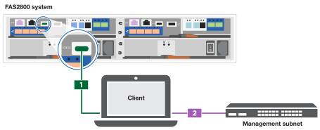

= Detailed steps - FAS2800
:icons: font
:imagesdir: ../media/

[.lead]
This procedure gives detailed step-by-step instructions for installing a typical NetApp storage system. Use this procedure if you want more detailed installation instructions.

== Step 1: Prepare for installation

.Before you begin

You need to provide the following at your site:

* Rack space for the storage system in either a telco rack or system cabinet.
** 2U for the storage system
** 2U or 4U for each drive shelf in your system
* Phillips #2 screwdriver
* Additional networking cables to connect your storage system to your network switch and laptop or console with a Web browser
* A laptop or console with an RJ-45 connection and access to a Web browser
** Access to the https://hwu.netapp.com[NetApp Hardware Universe] for information about site requirements as well as additional information on your configured storage system. 
**  You might also want to have access to the http://mysupport.netapp.com/documentation/productlibrary/index.html?productID=62286[Release Notes for your version of ONTAP 9] for your version of ONTAP for more information about this storage system.

.Steps
. Unpack all boxes and inventory the contents.
+
IMPORTANT: Customers with specific power requirements must check https://hwu.netapp.com[NetApp Hardware Universe] for their configuration options.
+
. Access the https://docs.netapp.com/us-en/ontap/task_configure_ontap.html#assign-a-node-management-ip-address[Configure ONTAP on a new cluster with System Manager^]
.. Review the requirements amd procedure steps.
.. Gather information about your storage system by completing the https://docs.netapp.com/us-en/ontap/task_configure_ontap.html[setup worksheet^ (need the URL to the worksheet)].
.. Record the storage system serial number from the controllers.
+
image::../media/drw_ssn_label.svg[width=220px]

The following table identifies the types of cables you might receive. If you receive a cable not listed in the table, see the https://hwu.netapp.com[NetApp Hardware Universe] to locate the cable and identify its use.

[options="header" cols="1,2,1,2"]
|===
| Type of cable...| Part number and length| Connector type| For...
a|
10 GbE, SFP28 cable (order dependent)
a|
X6566B-05-R6, .5,

X6566B-2-R6, 2m

a|
image::../media/oie_cable_sfp_gbe_copper.svg[width=100px]
a|
Network cable
a|
25Gb Ethernet, SFP28
a|
X66240A-05, .5m

X66240-2, 2m

X66240A-5, 5m

a|
image::../media/oie_cable_25Gb_Ethernet_SFP28_IEOPS-1069.svg[width=100px]
a|
Network cable
a|
32Gb Fiber Channel,
SFP+ (target/initiator)
a|
X66250-2, 2m

X66250-5, 5m

X66250-15, 15m
a|
image::../media/oie_cable_sfp_gbe_copper.svg[width=100px]
a|
FC network
a|
Cat 6, RJ-45 (order dependent)
a|
X6561-R6

X6562-R6
a|
image::../media/oie_cable_rj45.svg[width=100px]
a|
Management network and Ethernet data
a|
Storage 
a|
X66030A, 0.5m

X66031A, 1m

X66032A, 2m
a|
image::../media/oie_cable_mini_sas_hd_to_mini_sas_hd.svg[width=100px]
a|
Storage
a|
USB-C console cable
a|
No part number label
a|

a|
Console connection during software setup on non-Windows or Mac laptop/console
a|
Power cables
a|
No part number label
a|

a|
Powering up the storage system
a|
Optional FC cable
a|
Optional FC cable
a|

a|
Additional FC network cable

|===

== Step 2: Install the hardware

Install your storage system in a telco rack or NetApp storage system cabinet, as applicable.

.Steps
. Install the rail kits, as needed.
. Install and secure your storage system using the instructions included with the rail kit.
+
NOTE: You need to be aware of the safety concerns associated with the weight of the storage system.
+

. Attach cable management devices (as shown).
+
image::../media/drw_cable_management_arm_install.svg[width=320px]

. Place the bezel on the front of the storage system.

== Step 3: Cable controllers to your network

Cable the controllers to your network as either a two-node switchless cluster or a switched cluster.

The following table identifies the cable type with the call out number and cable color in the illustrations for both two-node switchless cluster and switched cluster.

[options="header" cols="20%,80%"]
|===
| Cabling|Connection type
a|
image::../media/oie_legend_icon_1_lg.svg[width=40px]
a|
Cluster interconnect
a|

a|
Management network switch
a|

a|
Host network switches

|===

.Before you begin

* Contact your network administrator for information about connecting the storage system to the switches.
* Check the illustration arrow for the proper cable connector pull-tab orientation.
** As you insert the connector, you should feel it click into place; if you do not feel it click, remove it, turn the cable head over and try again.
** If connecting to an optical switch, insert the SFP into the controller port before cabling to the port.

image::../media/oie_cable_pull_tab_down.svg[width=320px]

[role="tabbed-block"]
====

.Option 1: Cable a two-node switchless cluster
--

Cable your network connections and your cluster interconnect ports for a two-node switchless cluster.

.About this task

Use the animation or the step-by step instructions to complete the cabling between the controllers and to the switches.

video::90577508-fa79-46cf-b18a-afe8016325af[panopto, title= Animation - Cabling a two-node switchless cluster cabling]

.Steps

. Cable the cluster interconnect ports e0a to e0a and e0b to e0b with the cluster interconnect cable: 
+
image::../media/oie_cable_25Gb_Ethernet_SFP28_IEOPS-1069.svg[width=100pxx]
*Cluster interconnect cables*
+

. Cable the e0M ports to the management network switches with the RJ45 cables:
+
image::../media/oie_cable_rj45.svg[width=100px]
*RJ45 cables*
+

+
. Cable the mezzanine card ports to your host network. 
+
image::../media/drw_2800_network_cabling_IEOPS-894.svg[width=500px]

.. If you have a 4-port Ethernet data network, cable ports e1a through e1d to your Ethernet data network. 
** 4-ports, 10/25Gb Ethernet, SFP28 
+
image::../media/oie_cable_sfp_gbe_copper.svg[width=100px] 
+
image::../media/oie_cable_25Gb_Ethernet_SFP28_IEOPS-1069.svg[width=100px]
+

** 4-ports, 10GBASE-T, RJ45 
+
image::../media/oie_cable_rj45.svg[width=100px]
+

.. If you have a 4-port Fiber Channel data network, cable ports 1a through 1d for your FC network.
** 4-ports, 32Gb Fiber Channel, SFP+ (target only) 
+
image::../media/oie_cable_sfp_gbe_copper.svg[width=100px]
+
** 4-ports, 32Gb Fiber Channel, SFP+ (initiator/target) 
+
image::../media/oie_cable_sfp_gbe_copper.svg[width=100px]
+
.. If you have a 2+2 card (2 ports with Ethernet connections and 2 ports with Fiber Channel connections), cable ports e1a and e1b to your FC data network and ports e1c and e1d to your Ethernet data network.
+
** 2-ports, 10/25Gb Ethernet (SFP28) + 2-ports 32Gb FC (SFP+) 
+
image::../media/oie_cable_sfp_gbe_copper.svg[width=100px]
+
image::../media/oie_cable_sfp_gbe_copper.svg[width=100px]

IMPORTANT: DO NOT plug in the power cords. 

--
.Option 2: Cable a switched cluster
--

Cable your network connections and your cluster interconnect ports for a switched cluster.

.About this task

Use the animation or the step-by step instructions to complete the cabling between the controllers and to the switches.

video::6553a3db-57dd-4247-b34a-afe8016315d4[panopto, title="Animation - Switched cluster cabling"]

.Steps

. Cable the cluster interconnect ports e0a to e0a and e0b to e0b with the cluster interconnect cable: 
+
image::../media/oie_cable_25Gb_Ethernet_SFP28_IEOPS-1069.svg[width=100pxx]
+

. Cable the e0M ports to the management network switches with the RJ45 cables:
+
image::../media/oie_cable_rj45.svg[width=100px]
+

+
. Cable the mezzanine card ports to your host network. 
+
image::../media/drw_2800_network_cabling_IEOPS-894.svg[width=500px]

.. If you have a 4-port Ethernet data network, cable ports e1a through e1d to your Ethernet data network. 
** 4-ports, 10/25Gb Ethernet, SFP28 
+
image::../media/oie_cable_sfp_gbe_copper.svg[width=100px] 
+
image::../media/oie_cable_25Gb_Ethernet_SFP28_IEOPS-1069.svg[width=100px]
+

** 4-ports, 10GBASE-T, RJ45 
+
image::../media/oie_cable_rj45.svg[width=100px]
+

.. If you have a 4-port Fiber Channel data network, cable ports 1a through 1d for your FC network.
** 4-ports, 32Gb Fiber Channel, SFP+ (target only) 
+
image::../media/oie_cable_sfp_gbe_copper.svg[width=100px]
+
** 4-ports, 32Gb Fiber Channel, SFP+ (initiator/target) 
+
image::../media/oie_cable_sfp_gbe_copper.svg[width=100px]
+
.. If you have a 2+2 card (2 ports with Ethernet connections and 2 ports with Fiber Channel connections), cable ports e1a and e1b to your FC data network and ports e1c and e1d to your Ethernet data network.
+
** 2-ports, 10/25Gb Ethernet (SFP28) + 2-ports 32Gb FC (SFP+) 
+
image::../media/oie_cable_sfp_gbe_copper.svg[width=100px]
+
image::../media/oie_cable_sfp_gbe_copper.svg[width=100px]

IMPORTANT: DO NOT plug in the power cords. 

--

====

== Step 4: Cable controllers to drive shelves

Cable your controllers to external storage.

The following table identifies the cable type with the call out number and cable color in the illustrations for cabling your drive shelves to your storage system.

NOTE: The example uses DS224C. Cabling is similar with other supported drive shelves. See https://docs.netapp.com/us-en/ontap-systems/sas3/install-new-system.html[Install and cable shelves for a new system installation - shelves with IOM12/IOM12B modules^] for more information.

[options="header" cols="20%,80%"]
|===
| Cabling|Connection type
a|
image::../media/oie_legend_icon_1_lo.svg[width=40px]
a|
Shelf-to-shelf cabling
a|
image::../media/oie_legend_icon_2_mb.svg[width=40px]
a|
Controller A to the drive shelves
a|
image::../media/oie_legend_icon_3_t.svg[width=40px]
a|
Controller B to the drive shelves

|===

Be sure to check the illustration arrow for the proper cable connector pull-tab orientation.

image::../media/oie_cable_pull_tab_down.svg[width=320px]

.About this task

Use the animation or the step-by step instructions to complete the cabling between the controllers and to the drive shelves.

IMPORTANT: Do not use port 0b2 on a FAS2800. This SAS port is not used by ONTAP and is always disabled. See https://docs.netapp.com/us-en/ontap-systems/sas3/install-new-system.html[Install a shelf in a new storage system^] for more information.

video::b2a7549d-8141-47dc-9e20-afe8016f4386[panopto, title="Animation - Drive shelf cabling"]

.Steps

. Cable the shelf-to-shelf ports.
.. Port 1 on IOM A to port 3 on the IOM A on the shelf directly below.
.. Port 1 on IOM B to port 3 on the IOM B on the shelf directly below.
+
image::../media/oie_cable_mini_sas_hd_to_mini_sas_hd.svg[width=85px]     
*mini-SAS HD to mini-SAS HD cables*
+
image::../media/drw_2800_shelf-to-shelf_cabling_IEOPS-895.svg[width=500px]
+
. Cable controller A to the drive shelves.
.. Controller A port 0a to IOM B port 1 on first drive shelf in the stack.
 .. Controller A port 0b1 to IOM A port 3 on the last drive shelf in the stack.
+
image::../media/oie_cable_mini_sas_hd_to_mini_sas_hd.svg[width=85px]     
*mini-SAS HD to mini-SAS HD cables*
+
     
+
. Connect controller B to the drive shelves.
.. Controller B port 0a to IOM A port 1 on first drive shelf in the stack.
.. Controller B port 0b1 to IOM B port 3 on the last drive shelf in the stack.
+ 
image::../media/oie_cable_mini_sas_hd_to_mini_sas_hd.svg[width=85px]     
*mini-SAS HD to mini-SAS HD cables*
+

== Step 5: Complete storage system setup and configuration

Complete your storage system setup and configuration using either Option 1: if network  discovery enabled or Option 2: if network discovery is not enabled. 

[role="tabbed-block"]
====

.Option 1: If network discovery is enabled
--

If network discovery enabled on your laptop, complete storage system setup and configuration using automatic cluster discovery.

.Steps
. Use the following animation to turn on shelf power and set shelf IDs.
+
video::c600f366-4d30-481a-89d9-ab1b0066589b[panopto, title="Animation - Set drive shelf IDs"]

. Power on the controllers 
.. Plug the power cords into the controller power supplies, and then connect them to power sources on different circuits.
.. Turn on the power switches to both nodes.
+
NOTE: Initial booting may take up to eight minutes.
+

image::../media/dwr_2800_turn_on_power_IEOPS-898.svg[width=500px]

. Make sure that your laptop has network discovery enabled.
+
See your laptop's online help for more information.

. Connect your laptop to the Management switch.

.  Use  the graphic or steps to discover the storage system node to configure::
+
image::../media/drw_autodiscovery_controler_select.svg[width=500px]

 .. Open File Explorer.
 .. Click network in the left pane.
 .. Right click and select refresh.
 .. Double-click either ONTAP icon and accept any certificates displayed on your screen.
+
NOTE: XXXXX is the storage system serial number for the target node.
+
System Manager opens.

. Use System Manager guided setup to configure your storage system using the data you collected in <<Step 1: Prepare for installation>>.
. Create an account or log into your account.
.. Click https://mysupport.netapp.com[mysupport.netapp.com]
.. Click _Create Account_ if you need to create an account or log into your account.
. Download and install https://mysupport.netapp.com/site/tools[Active IQ Config advisor]
.. Verify the health of your storage system by running Active IQ Config Advisor.
. Register your system at https://mysupport.netapp.com/site/systems/register.
. After you have completed the initial configuration, go to the https://www.netapp.com/support-and-training/documentation/[NetApp ONTAP Resources] page for information about configuring additional features in ONTAP.

--
.Option 2: If network discovery is not enabled
--

If network discovery is not enabled on your laptop, manually complete the configuration and setup.

.Steps
. Cable and configure your laptop or console:
 .. Set the console port on the laptop or console to 115,200 baud with N-8-1.
+
NOTE: See your laptop or console's online help for how to configure the console port.

 .. Connect the console cable to the laptop or console, and connect the console port on the controller using the console cable that came with your storage system, and then cConnect the laptop or console to the switch on the management subnet.
+

 .. Assign a TCP/IP address to the laptop or console, using one that is on the management subnet.
. Use the following animation to set one or more drive shelf IDs:
+
video::c600f366-4d30-481a-89d9-ab1b0066589b[panopto, title="Animation - Set drive shelf IDs"]

. Plug the power cords into the controller power supplies, and then connect them to power sources on different circuits.
. Turn on the power switches to both nodes.
+
image::../media/dwr_2800_turn_on_power_IEOPS-898.svg[width=500px]
+
NOTE: Initial booting may take up to eight minutes.

. Assign an initial node management IP address to one of the nodes.
+

[options="header" cols="20%,80%"]
|===
| If the management network has DHCP...| Then...
a|
Configured
a|
Record the IP address assigned to the new controllers.
a|
Not configured
a|

 .. Open a console session using PuTTY, a terminal server, or the equivalent for your environment.
+
NOTE: Check your laptop or console's online help if you do not know how to configure PuTTY.

 .. Enter the management IP address when prompted by the script.

|===

. Using System Manager on your laptop or console, configure your cluster:
 .. Point your browser to the node management IP address.
+
NOTE: The format for the address is https://x.x.x.x.

 .. Configure the storage system using the data you collected in <<Step 1: Prepare for installation>>..
. Create an account or log into your account.
.. Click https://mysupport.netapp.com[mysupport.netapp.com]
.. Click _Create Account_ if you need to create an account or log into your account.
. Download and install https://mysupport.netapp.com/site/tools[Active IQ Config advisor]
.. Verify the health of your storage system by running Active IQ Config Advisor.
. Register your system at https://mysupport.netapp.com/site/systems/register.
. After you have completed the initial configuration, go to the https://www.netapp.com/support-and-training/documentation/[NetApp ONTAP Resources] page for information about configuring additional features in ONTAP.

--

====