= Detailed steps - FAS2800
:icons: font
:imagesdir: ../media/

[.lead]
This guide gives detailed step-by-step instructions for installing a typical NetApp system. Use this guide if you want more detailed installation instructions.

== Step 1: Prepare for installation

To install your FAS2800 system, you need to create an account on the NetApp Support Site, register your system, and get license keys. You also need to inventory the appropriate number and type of cables for your system and collect specific network information.

You need to have access to the https://hwu.netapp.com[NetApp Hardware Universe] for information about site requirements as well as additional information on your configured system. You might also want to have access to the http://mysupport.netapp.com/documentation/productlibrary/index.html?productID=62286[Release Notes for your version of ONTAP 9] for your version of ONTAP for more information about this system.

You need to provide the following at your site:

* Rack space for the storage system
* Phillips #2 screwdriver
* Additional networking cables to connect your system to your network switch and laptop or console with a Web browser
* A laptop or console with an RJ-45 connection and access to a Web browser

.Steps
. Unpack the contents of all boxes.
. Record the system serial number from the controllers.
+

. Set up your account:
.. Log in to your existing account or create an account.
.. Register your system through  https://mysupport.netapp.com/eservice/registerSNoAction.do?moduleName=RegisterMyProduct[NetApp Product Registration]
. Download and install https://mysupport.netapp.com/site/tools/tool-eula/activeiq-configadvisor[Config Advisor] on your laptop.

. Inventory and make a note of the number and types of cables you received.
+
The following table identifies the types of cables you might receive. If you receive a cable not listed in the table, see the https://hwu.netapp.com[NetApp Hardware Universe] to locate the cable and identify its use.
+

[options="header" cols="1,2,1,2"]
|===
| Type of cable...| Part number and length| Connector type| For...
a|
10 GbE, SFP28 cable (order dependent)
a|
X66240A-05, 0.5m,

X66240A-2, 2m,

X66240A-5, 5m, 0.5m
a|
image:../media/oie_cable_sfp_gbe_copper.svg[width=100px]
a|
Network cable
a|
25Gb Ethernet, SFP28
a|
X6566B-2-R6, 2m

X6566B-5-R6, 5m
a|

a|
Network cable
a|
32Gb Fiber Channel,
SFP+ (target/initiator)
a|
X66250-2, 2m

X66250-5, 5m

X66250-15, 15m
a|
image:../media/oie_cable_sfp_gbe_copper.svg[width=100px]
a|
FC network
a|
Cat 6, RJ-45 (order dependent)
a|
X6561-R6

X6562-R6
a|
image:../media/oie_cable_rj45.svg[width=100px]
a|
Management network and Ethernet data
a|
Storage 
a|
X66211A-05 (112-00595), 0.5m

X66211B-1 (112-00573), 1m

X66211B-2 (112-00574), 2m

X66211B-5 (112-00576), 5m
a|
image:../media/oie_cable_mini_sas_hd_to_mini_sas_hd.svg[width=100px]
a|
Storage
a|
Micro-USB console cable
a|
Not applicable
a|

a|
Console connection during software setup on non-Windows or Mac laptop/console
a|
Power cables
a|
Not applicable
a|

a|
Powering up the system
a|
Optional FC cable
a|
Optional FC cable
a|

a|
Additional FC network cable

|===

. Download and complete the worksheets found in  https://docs.netapp.com/us-en/ontap/software_setup/concept_set_up_the_cluster.html#cluster-setup-worksheets[Set up the cluster with the ONTAP CLI^].

== Step 2: Install the hardware

You need to install your system in a 4-post rack or NetApp system cabinet, as applicable.

.Steps
. Install the rail kits, as needed.
. Install and secure your system using the instructions included with the rail kit.
+
NOTE: You need to be aware of the safety concerns associated with the weight of the system.
+
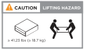

. Attach cable management devices (as shown).
+
image::../media/drw_cable_management_arm_install.svg[width=320px]

. Place the bezel on the front of the system.

== Step 3: Cable controllers to your network

Ccable the controllers to your network using the two-node switchless cluster method or using the cluster interconnect network method.

[role="tabbed-block"]
====

.Option 1: Cable a two-node switchless cluster
--

Cable your network connections and your cluster interconnect ports.

NOTE: You must have contacted your network administrator for information about connecting the system to the switches.

Be sure to check the illustration arrow for the proper cable connector pull-tab orientation.

image::../media/oie_cable_pull_tab_down.svg[width=320px]

NOTE: As you insert the connector, you should feel it click into place; if you do not feel it click, remove it, turn it around and try again.

.Steps
. You can use the graphic or the step-by step instructions to complete the cabling between the controllers and to the switches:
+
video::90577508-fa79-46cf-b18a-afe8016325af[panopto, title= Animation - Cabling a two-node switchless cluster cabling]

+

[options="header" cols="20%,80%"]

|===
| Step| Perform on each controller
a|

a|
Cable the cluster interconnect ports to each other with the cluster interconnect cable: 

** e0a to e0a
** e0b to e0b

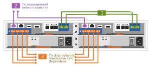
a|

a|
Cable the e0M ports to the management network switches with the RJ45 cables:

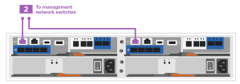
a|

a|
Select one of the following cable connections to cable the mezzanine card ports to your host network:

Four ports::
** 4-ports, 10/25Gb Ethernet, SFP28 - image:../media/oie_cable_sfp_gbe_copper.svg[width=100px] 

** 4-ports, 32Gb Fiber Channel, SFP+ (target only) image:../media/oie_cable_sfp_gbe_copper.svg[width=100px]
** 4-ports, 32Gb Fiber Channel, SFP+ (initiator/target) image:../media/oie_cable_sfp_gbe_copper.svg[width=100px]
** 4-ports, 10GBASE-T, RJ45 image:../media/oie_cable_rj45.svg[width=100px]
+ 
Cable ports e1a through e1d to your Ethernet data network or ports 1-a-1d for your FC network.
2+2 ports::
** 2-ports, 10/25Gb Ethernet (SFP28) + 2-ports 32Gb FC (SFP+) image:../media/oie_cable_sfp_gbe_copper.svg[width=100px]
+
Cable ports 1a and 1b to your FC data network and ports e1c and e1d to your Ethernet data network.

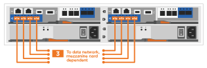

a|

a|
DO NOT plug in the power cords at this point.

|===

--
.Option 2: Cable a switched cluster
--

Management network, Ethernet data network, and management ports on the controllers are connected to switches. The cluster interconnect ports are cabled to the cluster interconnect switches.

You must have contacted your network administrator for information about connecting the system to the switches.

Be sure to check the illustration arrow for the proper cable connector pull-tab orientation.

image::../media/oie_cable_pull_tab_down.svg[width=320px]

NOTE: As you insert the connector, you should feel it click into place; if you do not feel it click, remove it, turn it around and try again.

.Steps
. You can use the graphic or the step-by step instructions to complete the cabling between the controllers and the switches:
+

video::6553a3db-57dd-4247-b34a-afe8016315d4[panopto, title="Animation - Switched cluster cabling"]

+

[options="header" cols="20%,80%"]
|===
| Step| Perform on each controller module
a|

a|
Cable e0a and e0b to the cluster interconnect switches with the cluster interconnect cable:
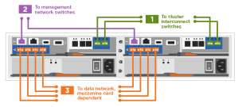
a|

a|
Cable the e0M ports to the management network switches with the RJ45 cables:

a|

a|
Select one of the following cable connections to cable the mezzanine card ports to your host network:

Four ports::
** 4-ports, 10/25Gb Ethernet, SFP28 - image:../media/oie_cable_sfp_gbe_copper.svg[width=85px] 

** 4-ports, 32Gb Fiber Channel, SFP+ (target only) image:../media/oie_cable_sfp_gbe_copper.svg[width=85px]
** 4-ports, 32Gb Fiber Channel, SFP+ (initiator/target) image:../media/oie_cable_sfp_gbe_copper.svg[width=85px]
** 4-ports, 10GBASE-T, RJ45 image:../media/oie_cable_rj45.svg[width=85px]
+ 
Cable ports e1a through e1d to your Ethernet data network or ports 1-a-1d for your FC network.
2+2 ports::
** 2-ports, 10/25Gb Ethernet (SFP28) + 2-ports 32Gb FC (SFP+) image:../media/oie_cable_sfp_gbe_copper.svg[width=85px]
+
Cable ports 1a and 1b to your FC data network and ports e1c and e1d to your Ethernet data network.

a|

a|
DO NOT plug in the power cords at this point.

|===

--

====

== Step 4: Cable controllers to drive shelves

Cable your controllers to external storage.

Be sure to check the illustration arrow for the proper cable connector pull-tab orientation.

image::../media/oie_cable_pull_tab_down.svg[width=320px]

.Steps
. Cable the HA pair with external drive shelves:
+
NOTE: The example uses DS224C. Cabling is similar with other supported drive shelves.
+

video::b2a7549d-8141-47dc-9e20-afe8016f4386[panopto, title="Animation - Drive shelf cabling"]
+

[options="header" cols="20%,80%"]

|===
| Step| Perform on each controller
a|
image:../media/oie_legend_icon_1_lo.svg[width=30px]
a|
Cable the shelf-to-shelf ports.

 ** Port 3 on IOM A to port 1 on the IOM A on the shelf directly below.
 ** Port 3 on IOM B to port 1 on the IOM B on the shelf directly below.
+
image:../media/oie_cable_mini_sas_hd_to_mini_sas_hd.svg[width=85px]     
mini-SAS HD to mini-SAS HD cables

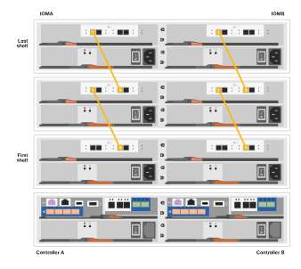

a|
image:../media/oie_legend_icon_2_mb.svg[width=30px]
a|
Controller A to the drive shelves.

 ** Controller A port 0a to IOM B port 1 on first drive shelf in the stack.
 ** Controller A port 0b1 to IOM A port 3 on the first drive shelf in the stack.
+
image:../media/oie_cable_mini_sas_hd_to_mini_sas_hd.svg[width=85px]     
mini-SAS HD to mini-SAS HD cables

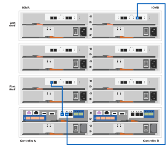     

a|

a|
Connect controller B to the drive shelves.

 ** Controller B port 0a to IOM A port 1 on first drive shelf in the stack.
 ** Controller B port 0b1 to IOM B port 3 on the last drive shelf in the stack.
 +
 image:../media/oie_cable_mini_sas_hd_to_mini_sas_hd.svg[width=85px]     
mini-SAS HD to mini-SAS HD cables

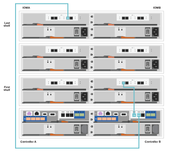

|===

+
If you have more than one drive shelf stack, see the link:../com.netapp.doc.hw-ds-sas3-icg/home.html[Installing and cabling] for your drive shelf type.

== Step 5: Complete system setup and configuration

You can complete the system setup and configuration using cluster discovery with only a connection to the switch and laptop, or by connecting directly to a controller in the system and then connecting to the management switch.

[role="tabbed-block"]
====

.Option 1: If network discovery is enabled
--

If network discovery enabled on your laptop, complete system setup and configuration using automatic cluster discovery.

.Steps
. Use the following animation to set one or more drive shelf IDs
+
video::c600f366-4d30-481a-89d9-ab1b0066589b[panopto, title="Animation - Set drive shelf IDs"]

. Plug the power cords into the controller power supplies, and then connect them to power sources on different circuits.
. Turn on the power switches to both nodes.
+
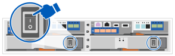
+
NOTE: Initial booting may take up to eight minutes.

. Make sure that your laptop has network discovery enabled.
+
See your laptop's online help for more information.

. Use the following animation to connect your laptop to the Management switch.
+
video::d61f983e-f911-4b76-8b3a-ab1b0066909b[panopto, title="Animation - Connect your laptop to the Management switch"]

. Select an ONTAP icon listed to discover:
+
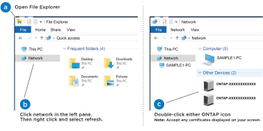

 .. Open File Explorer.
 .. Click network in the left pane.
 .. Right click and select refresh.
 .. Double-click either ONTAP icon and accept any certificates displayed on your screen.
+
NOTE: XXXXX is the system serial number for the target node.
+
System Manager opens.

. Use System Manager guided setup to configure your system using the data you collected in the https://library.netapp.com/ecm/ecm_download_file/ECMLP2862613[ONTAP Configuration Guide]

. Verify the health of your system by running Config Advisor.
. After you have completed the initial configuration, go to the https://www.netapp.com/data-management/oncommand-system-documentation/[ONTAP & ONTAP System Manager Documentation Resources] page for information about configuring additional features in ONTAP.

--
.Option 2: If network discovery is not enabled
--

If network discovery is not enabled on your laptop, manually complete the configuration and setup.

.Steps
. Cable and configure your laptop or console:
 .. Set the console port on the laptop or console to 115,200 baud with N-8-1.
+
NOTE: See your laptop or console's online help for how to configure the console port.

 .. Connect the console cable to the laptop or console, and connect the console port on the controller using the console cable that came with your system, and then cConnect the laptop or console to the switch on the management subnet.
+
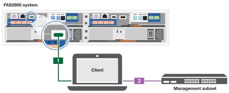

 .. Assign a TCP/IP address to the laptop or console, using one that is on the management subnet.
. Use the following animation to set one or more drive shelf IDs:
+
video::c600f366-4d30-481a-89d9-ab1b0066589b[panopto, title="Animation - Set drive shelf IDs"]

. Plug the power cords into the controller power supplies, and then connect them to power sources on different circuits.
. Turn on the power switches to both nodes.
+

NOTE: Initial booting may take up to eight minutes.

. Assign an initial node management IP address to one of the nodes.
+

[options="header" cols="20%,80%"]
|===
| If the management network has DHCP...| Then...
a|
Configured
a|
Record the IP address assigned to the new controllers.
a|
Not configured
a|

 .. Open a console session using PuTTY, a terminal server, or the equivalent for your environment.
+
NOTE: Check your laptop or console's online help if you do not know how to configure PuTTY.

 .. Enter the management IP address when prompted by the script.

|===

. Using System Manager on your laptop or console, configure your cluster:
 .. Point your browser to the node management IP address.
+
NOTE: The format for the address is https://x.x.x.x.

 .. Configure the system using the data you collected in the https://library.netapp.com/ecm/ecm_download_file/ECMLP2862613[ONTAP Configuration Guide].
. Verify the health of your system by running Config Advisor.
. After you have completed the initial configuration, go to  https://www.netapp.com/data-management/oncommand-system-documentation/[ONTAP & ONTAP System Manager Documentation Resources] for information about configuring additional features in ONTAP.

--

====