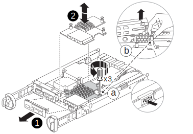

= Replace a mezzanine card - FAS2800
:icons: font
:imagesdir: ../media/

Replace the mezzanine card by disconnecting the cables and any SFP and QSFP modules from the card, replace the failed mezzanine card, and then recable the cards.

* You can use this procedure with all versions of ONTAP supported by your system
* All other components in the system must be functioning properly; if not, you must contact technical support.

video::a8ec891d-f6f6-4479-9ca2-af47017254ff[panopto, title="Animation - Replace the  mezzanine card"]

== Step 1: Shut down the impaired controller

include::../_include/shutdown_no_mcc.adoc[]

== Step 2: Remove the controller module

Remove the controller module from the system and then remove the cover on the controller module.

.Steps
. If you are not already grounded, properly ground yourself.
. Loosen the hook and loop strap binding the cables to the cable management device, and then unplug the system cables and SFPs (if needed) from the controller module, keeping track of where the cables were connected.
+
Leave the cables in the cable management device so that when you reinstall the cable management device, the cables are organized.

. Remove and set aside the cable management devices from the left and right sides of the controller module.
+
. Squeeze the latch on the cam handle until it releases, open the cam handle fully to release the controller module from the midplane, and then, using two hands, pull the controller module out of the chassis.
+
image::../media/drw_2850_pcm_remove_install_IEOPS-694.svg[width=500px]

. Turn the controller module over and place it on a flat, stable surface.
. Open the cover by pressing the blue buttons on the sides of the controller module to release the cover, and then rotate the cover up and off of the controller module.
+
image::../media/drw_2850_open_controller_module_cover_IEOPS-695.svg[width=500px]

[cols="1,3"]
|===

a|
image::../media/legend_icon_01.svg[width=20px]
a|
Controller module cover release button

|===

== Step 3: Replace the mezzanine card

. If you are not already grounded, properly ground yourself.
. Remove the mezzanine card using the following illustration or the FRU map on the controller module:
+

[cols="1,3"]
|===

a|
image::../media/legend_icon_01.svg[width=20px]
a|
Riser bezel
a|
image::../media/legend_icon_02.svg[width=20px]
a|
PCIe mezzanine card

|===

.. Remove the mezzanine card bezel by sliding it straight out from thr controller module.
.. Loosen the thumbscrews on the mezzanine card.  
+
NOTE: You can loosen the thumbscrews with your fingers or a screwdriver. If you use your fingers, you might need to rotate the NV battery up for better finger purchase on the thumbscrew next to it.
+
.. Lift the mezzanine card straight up.  

. Reinstall the mezzanine card:
.. Align the socket on the replacement mezzanine card plug with the socket on the motherboard, and then gently seat the card squarely into the socket.
.. Tighten the three thumbscrews on the mezzanine card.
.. Reinstall the mezzanine bezel.
. Reinstall the controller module cover and lock it into place.

== Step 4: Install the controller module

Reinstall the controller module.

.Steps
. If you are not already grounded, properly ground yourself.
. If you have not already done so, replace the cover on the controller module.
. Turn the controller module over and align the end with the opening in the chassis.
. Gently push the controller module halfway into the system.Align the end of the controller module with the opening in the chassis, and then gently push the controller module halfway into the system.
+
NOTE: Do not completely insert the controller module in the chassis until instructed to do so.

. Recable the system, as needed.
+
If you removed the media converters (QSFPs or SFPs), remember to reinstall them if you are using fiber optic cables.

. Complete the reinstallation of the controller module:
 .. With the cam handle in the open position, firmly push the controller module in until it meets the midplane and is fully seated, and then close the cam handle to the locked position.
+
NOTE: Do not use excessive force when sliding the controller module into the chassis to avoid damaging the connectors.
+
The controller begins to boot as soon as it is seated in the chassis.
 .. If you have not already done so, reinstall the cable management device.
 .. Bind the cables to the cable management device with the hook and loop strap.
 . Return the controller to normal operation by giving back its storage: `storage failover giveback -ofnode _impaired_node_name_`
. Restore automatic giveback by using the `storage failover modify -node local -auto-giveback true` command.
 Restore Autosupport using the `system node autosupport invoke -node * -type all -message MAINT=END`

== Step 5: Return the failed part to NetApp

include::../_include/complete_rma.adoc[]
