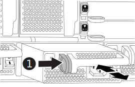
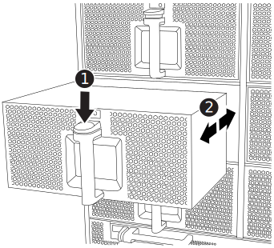
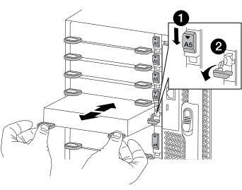
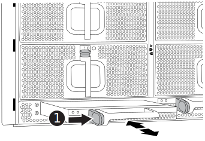
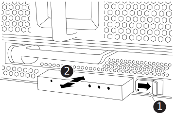

= Move and replace hardware - FAS9500
:icons: font
:imagesdir: ../media/

[.lead]
To replace the chassis, you must remove the components from the impaired chassis and install them in the replacement chassis.

== Step 1: Remove the power supplies

Removing the power supplies when replacing a chassis involves turning off, disconnecting, and then removing the four power supplies from the rear of the impaired chassis.

. If you are not already grounded, properly ground yourself.
. Turn off the power supply and disconnect the power cables:
.. Turn off the power switch on the power supply.
.. Open the power cable retainer, and then unplug the power cable from the power supply.
.. Unplug the power cable from the power source.
. Press and hold the terra cotta locking button on the power supply handle, and then pull the power supply out of the chassis.
+
NOTE: When removing a power supply, always use two hands to support its weight.

+
video::590b3414-6ea5-42b2-b7f4-ae78004b86a4[panopto, title="Animation - Remove/install PSU"]
+

+
[cols="20%,80%"]
|===
a|
image::../media/legend_icon_01.svg[width=20]
a|
Terra cotta locking button
|===

. Repeat the preceding steps for any remaining power supplies.

== Step 2: Remove the fans

You must remove the six fan modules, located on in the front of the chassis, when replacing the chassis.

. If you are not already grounded, properly ground yourself.
. Remove the bezel (if necessary) with two hands, by grasping the openings on each side of the bezel, and then pulling it toward you until the bezel releases from the ball studs on the chassis frame.
. Press the terra cotta locking button on the fan module and pull the fan module straight out of the chassis, making sure that you support it with your free hand.
+
NOTE: The fan modules are short. Always support the bottom of the fan module with your free hand so that it does not suddenly drop free from the chassis and injure you.
+
video::86b0ed39-1083-4b3a-9e9c-ae78004c2ffc[panopto, title="Animation - Remove/install fan"]
+

+
[cols="20%,80%"]
|===
a|
image:../media/legend_icon_01.svg[width=20]
a|
Terra cotta locking button
a|
image:../media/legend_icon_02.svg[width=20]
a|
Slide fan in/out of chassis
|===

. Set the fan module aside.
. Repeat the preceding steps for any remaining fan modules.

== Step 3: Remove the controller module

To replace the chassis, you must remove the controller module or modules from the impaired chassis.

. If you are not already grounded, properly ground yourself.
. Unplug the cables from the impaired controller module, and keep track of where the cables were connected.
. Slide the terra cotta locking button on the cam handle downward until it unlocks.
+
video::5e029a19-8acc-4fa1-be5d-ae78004b365a[panopto, title="Animation - Remove controller module"]
+
image::../media/drw_9500_remove_PCM.svg[width=340]
+
[cols="20%,80%"]
|===
a|
image:../media/legend_icon_01.svg[width=20]
a|
Cam handle locking button
a|
image:../media/legend_icon_02.svg[width=20]
a|
Cam handle
|===

. Rotate the cam handle so that it completely disengages the controller module from the chassis, and then slide the controller module out of the chassis.
+
Make sure that you support the bottom of the controller module as you slide it out of the chassis.
. Set the controller module aside in a safe place and keep track of which chassis slot it came from, so that it can be installed into the same slot in the replacement chassis..
. Repeat these steps if you have another controller module in the chassis.

== Step 4: Remove the I/O modules

To remove I/O modules from the impaired chassis, including the NVRAM modules, follow the specific sequence of steps. You do not have to remove the FlashCache module, if present, from the NVRAM module when moving it to a replacement chassis.

. If you are not already grounded, properly ground yourself.
. Unplug any cabling associated with the target I/O module.
+
Make sure that you label the cables so that you know where they came from.
. Remove the target I/O module from the chassis:
.. Depress the lettered and numbered cam locking button.
+
The cam locking button moves away from the chassis.
.. Rotate the cam latch down until it is in a horizontal position.
+
The I/O module disengages from the chassis and moves about 1/2 inch out of the I/O slot.
.. Remove the I/O module from the chassis by pulling on the pull tabs on the sides of the module face.
+
Make sure that you keep track of which slot the I/O module was in.
+
video::0903b1f9-187b-4bb8-9548-ae9b0012bb21[panopto, title="Animation - Remove/install I/O module"]
+

+
[cols="20%,80%"]
|===
a|
image::../media/legend_icon_01.svg[width=20]
a|
Lettered and numbered I/O cam latch
a|
image::../media/legend_icon_02.svg[width=20]
a|
I/O cam latch completely unlocked
|===

. Set the I/O module aside.
. Repeat the preceding step for the remaining I/O modules in the impaired chassis.

== Step 5: Remove the De-stage Controller Power Module

Remove the two de-stage controller power modules from the front of the impaired chassis.

. If you are not already grounded, properly ground yourself.
. Press the terra cotta locking button on the module handle, and then slide the DCPM out of the chassis.
+
video::c067cf9d-35b8-4fbe-9573-ae78004c2328[panopto, title="Animation - Remove/install DCPM"]
+

+
[cols="20%,80%"]
|===
a|
image::../media/legend_icon_01.svg[width=20]
a|
DCPM terra cotta locking button
|===

. Set the DCPM aside in a safe place and repeat this step for the remaining DCPM.

== Step 6: Remove the USB LED module 

Remove the USB LED modules.

video::bc46a3e8-6541-444e-973b-ae78004bf153[panopto, title="Animation - Remove/install USB module"]

[cols="20%,80%"]
|===
a|
image::../media/legend_icon_01.svg[width=20]
a|
Eject the module.
a|
image:../media/legend_icon_02.svg[width=20]
a|
Slide out of chassis.
|===

. Locate the USB LED module on the front of the impaired chassis, directly under the power supply bays.
. Press the black locking button on the right side of the module to release the module from the chassis, and then slide it out of the impaired chassis.
. Set the module aside in a safe place.

== Step 7: Replace a chassis from within the equipment rack or system cabinet

You must remove the existing chassis from the equipment rack or system cabinet before you can install the replacement chassis.

. Remove the screws from the chassis mount points.
+
NOTE: If the system is in a system cabinet, you might need to remove the rear tie-down bracket.

. With the help of two or three people, slide the impaired chassis off the rack rails in a system cabinet or _L_ brackets in an equipment rack, and then set it aside.
. If you are not already grounded, properly ground yourself.
. Using two or three people, install the replacement chassis into the equipment rack or system cabinet by guiding the chassis onto the rack rails in a system cabinet or _L_ brackets in an equipment rack.
. Slide the chassis all the way into the equipment rack or system cabinet.
. Secure the front of the chassis to the equipment rack or system cabinet, using the screws you removed from the impaired chassis.
. Secure the rear of the chassis to the equipment rack or system cabinet.
. If you are using the cable management brackets, remove them from the impaired chassis, and then install them on the replacement chassis.

== Step 8: Install the de-stage controller power module when replacing the chassis

Once the replacement chassis is installed into the rack or system cabinet, you must reinstall the de-stage controller power modules into it.

. If you are not already grounded, properly ground yourself.
. Align the end of the DCPM with the chassis opening, and then gently slide it into the chassis until it clicks into place.
+
NOTE: The module and slot are keyed. Do not force the module into the opening. If the module does not go in easily, realign the module and slide it into the chassis.

. Repeat this step for the remaining DCPM.

== Step 9: Install fans into the chassis

To install the fan modules when replacing the chassis, you must perform a specific sequence of tasks.

. If you are not already grounded, properly ground yourself.
. Align the edges of the replacement fan module with the opening in the chassis, and then slide it into the chassis until it snaps into place.
+
When inserted into a live system, the amber Attention LED flashes four times when the fan module is successfully inserted into the chassis.
. Repeat these steps for the remaining fan modules.
. Align the bezel with the ball studs, and then gently push the bezel onto the ball studs.

== Step 10: Install I/O modules

To install I/O modules, including the NVRAM/FlashCache modules from the impaired chassis, follow the specific sequence of steps.

You must have the chassis installed so that you can install the I/O modules into the corresponding slots in the replacement chassis.

. If you are not already grounded, properly ground yourself.
. After the replacement chassis is installed in the rack or cabinet, install the I/O modules into their corresponding slots in the replacement chassis by gently sliding the I/O module into the slot until the lettered and numbered I/O cam latch begins to engage, and then push the I/O cam latch all the way up to lock the module in place.
. Recable the I/O module, as needed.
. Repeat the preceding step for the remaining I/O modules that you set aside.
+
NOTE: If the impaired chassis has blank I/O panels, move them to the replacement chassis at this time.

== Step 11: Install the power supplies

Installing the power supplies when replacing a chassis involves installing the power supplies into the replacement chassis, and connecting to the power source.

. If you are not already grounded, properly ground yourself.
. Make sure the power supplies rockers are in the off position.
. Using both hands, support and align the edges of the power supply with the opening in the system chassis, and then gently push the power supply into the chassis until it locks into place.
+
The power supplies are keyed and can only be installed one way.
+
IMPORTANT: Do not use excessive force when sliding the power supply into the system. You can damage the connector.

. Reconnect the power cable and secure it to the power supply using the power cable locking mechanism.
+
IMPORTANT: Only connect the power cable to the power supply. Do not connect the power cable to a power source at this time.

. Repeat the preceding steps for any remaining power supplies.

== Step 12 Install the USB LED modules

Install the USB LED modules in the replacement chassis.

. Locate the USB LED module slot on the front of the replacement chassis, directly under the DCPM bays.
. Align the edges of the module with the USB LED bay, and gently push the module all the way into the chassis until it clicks into place.

== Step 13: Install the controller

After you install the controller module and any other components into the replacement chassis, boot it to a state where you can run the interconnect diagnostic test.

. If you are not already grounded, properly ground yourself.
. Connect the power supplies to different power sources, and then turn them on.
. Align the end of the controller module with the opening in the chassis, and then gently push the controller module halfway into the system.
+
NOTE: Do not completely insert the controller module in the chassis until instructed to do so.

. Recable the console to the controller module, and then reconnect the management port.
. With the cam handle in the open position, slide the controller module into the chassis and firmly push the controller module in until it meets the midplane and is fully seated, and then close the cam handle until it clicks into the locked position.
+
IMPORTANT: Do not use excessive force when sliding the controller module into the chassis; you might damage the connectors.
+
The controller module begins to boot as soon as it is fully seated in the chassis.

. Repeat the preceding steps to install the second controller into the replacement chassis.
. Boot each controller.