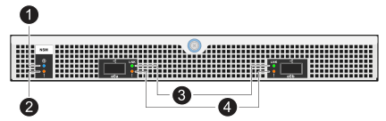
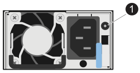
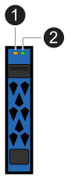

= Monitor drive shelf LEDs - NS224 shelves
:icons: font
both:imagesdir: ../media/

[.lead]
You can monitor the health of your drive shelf by understanding the location and status conditions of the LEDs on your drive shelf components.

* The location (blue) LEDs, on a shelf's operator display panel (ODP) and both NSM modules, can be activated to aid in physically locating the shelf that needs servicing: `storage shelf location-led modify -shelf-name _shelf_name_ -led-status on`
+
If you do not know the `_shelf_name_` of the affected shelf, run the `storage shelf show` command.
+
Location LEDs remain illuminated for 30 minutes. You can turn them off by entering the same command, but using the `off` option.

* An LED state can be:
** "On": The LED illumination is solid/steady
** "Off": The LED is not illuminated
** "Blink": The LED turns on and off at varying intervals depending on the FRU status
** "Any state": The LED can be "On", "Off", or "Blink"

== Operator display panel LEDs

The LEDs on the drive shelf front operator display panel (ODP) indicate whether your drive shelf is functioning normally or there are problems with the hardware.

The following illustration and table describes the three LEDs on the ODP:

[cols="1,2,1,5" options="header"]
|===
| LED icon| LED name & color| State| Description
a|
image::../media/drw_sas_power_icon.svg[width=20px]
a|
Power (Green)
a|
On 
a|
One or more power supplies are supplying power to the drive shelf.
a|
image::../media/drw_sas_fault_icon.svg[width=5px]
a|
Attention (Amber)
a|
On
a|
* An error occurred with the function of one of more shelf FRUs.
+
Check event messages to determine corrective action to take.
* If the two-digit shelf ID is also blinking, the shelf ID is in a pending state.
+
Power cycle the drive shelf for the shelf ID to take affect.
a|
image::../media/drw_sas3_location_icon.svg[width=20px]
a|
Location (Blue)
a|
On
a|
The system administrator activated this LED function.
|===

== NSM module LEDs

The LEDs on an NSM module indicate whether the module is functioning normally, whether it is ready for I/O traffic, and whether there are any problems with the hardware.

The following illustration and tables describe NSM module LEDs associated with the function of a module and the function of each NVMe port on a module.

[cols="1,1,2,4" options="header"]
|===
| Call out| LED icon| Color| Description
a|
image:../media/legend_icon_01.png[Callout number 1] 
a|
image::../media/drw_sas3_location_icon.svg[width=20px]
a|
Blue
a|
NSM module: Location
a|
image:../media/legend_icon_02.png[Callout number 2]
a|
image::../media/drw_sas_fault_icon.svg[width=5px]
a|
Amber
a|
NSM module: Attention
a|
image:../media/legend_icon_03.png[Callout number 3] 
a|
LNK
a|
Green
a|
NVMe port/link: status
a|
image:../media/legend_icon_04.png[Callout number 4] 
a|
image::../media/drw_sas_fault_icon.svg[width=5px]
a|
Amber
a|
NVMe port/link: attention
|===

[cols="2,1,1,1" options="header"]
|===
| Status| NSM Attention (Amber)| Port LNK (Green)| Port Attention (Amber)
a|
NSM normal
a|
Off
a|
Any state
a|
Off
a|
NSM fault
a|
On
a|
Any state
a|
Any state
a|
NSM VPD Error
a|
On
a|
Any state
a|
Any state
a|
No host port connection
a|
Any state
a|
Off
a|
Off
a|
Host port connection link active
a|
Any state
a|
On/Blinks with activity
a|
Any state
a|
Host port connection w/ fault
a|
On
a|
On/Off if all lanes are faulted
a|
On
a|
BIOS boot from BIOS image after power up
a|
Blink
a|
Any state
a|
Any state
|===

== Power supply LEDs

The LEDs on an AC or DC power supply (PSU) indicate whether the PSU is functioning normally or there are hardware problems.

The following illustration and tables describe the LED on a PSU. (The illustration is an AC PSU; however, the LED location is the same on the DC PSU):

[cols="1,4" options="header"]
|===
| Call out| Description
a|
image:../media/legend_icon_01.png[Callout number 1]
a|
The bi-color LED indicates power/activity when green and a fault when amber.
|===

[cols="2,1,1" options="header"]
|===
| Status| Power/activity (Green)| Attention (Amber)
a|
No AC/DC power to the enclosure
a|
Off
a|
Off
a|
No AC/DC power to the PSU
a|
Off
a|
On

a|
AC/DC power on, but PSU not in enclosure
a|
Blink
a|
Off
a|
PSU operating correctly
a|
On
a|
Off
a|
PSU failure
a|
Off
a|
On
a|
Fan failure
a|
Off
a|
On
a|
Firmware update mode
a|
Blink
a|
Off
|===

== Drive LEDs

The LEDs on an NVMe drive indicates whether it is functioning normally or there are problems with the hardware.

The following illustration and tables describe the two LEDs on an NVMe drive:

[cols="1,2,2" options="header"]
|===
| Call out| LED name| Color
a|
image:../media/legend_icon_01.png[Callout number 1]
a|
Attention
a|
Amber
a|
image:../media/legend_icon_02.png[Callout number 2]
a|
Power/activity
a|
Green

|===

[cols="2,1,1,1" options="header"]
|===
| Status| Power/Activity (Green)| Attention (Amber)| Associated ODP LED
a|
Drive installed and operational
a|
On/Blinks with activity
a|
Any state
a|
N/A
a|
Drive failure
a|
On/Blinks with activity
a|
On
a|
Attention (Amber)
a|
SES device identify set
a|
On/Blinks with activity
a|
Blinks
a|
Attention (Amber) is off
a|
SES device fault bit set
a|
On/Blinks with activity
a|
On
a|
Attention (Amber)
a|
Power control circuit failure
a|
Off
a|
Any state
a|
Attention (Amber)

|===
