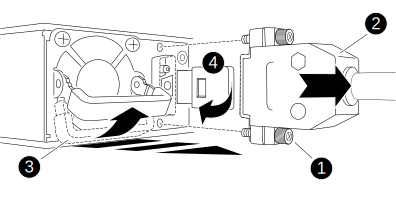

= Hot-swap a power supply - NS224 shelves
:icons: font
:imagesdir: ../media/

[.lead]
You can replace a failed power supply nondisruptively in an NS224 drive shelf that is powered on, and while I/O is in progress.

.About this task

* Do not mix power supplies with different efficiency ratings or with different input types. 
+
Always replace like for like.

* If you are replacing more than one power supply, you must do so one at a time so that the shelf maintains power.
* *Best practice:* The best practice is to replace the power supply within two minutes of removal from the NSM module.
+
If you exceed the two minutes, the shelf continues to function, but ONTAP sends messages to the console about the degraded power supply until the power supply is replaced.

* *Best practice:* The best practice is to have current versions of NVMe shelf module (NSM) firmware and drive firmware on your system before replacing FRU components.
+
https://mysupport.netapp.com/site/downloads/firmware/disk-shelf-firmware[NetApp Downloads: Disk Shelf Firmware^]
+
https://mysupport.netapp.com/site/downloads/firmware/disk-drive-firmware[NetApp Downloads: Disk Drive Firmware^]
+
[NOTE]
====
Do not revert firmware to a version that does not support your shelf and its components.
====
* If needed, you can turn on the shelf's location (blue) LEDs to aid in physically locating the affected shelf: `storage shelf location-led modify -shelf-name _shelf_name_ -led-status on`
+
If you do not know the `shelf_name` of the affected shelf, run the `storage shelf show` command.
+
A shelf has three location LEDs: one on the operator display panel and one on each NSM module. Location LEDs remain illuminated for 30 minutes. You can turn them off by entering the same command, but using the off option.

* When you unpack the replacement power supply, save all packing materials for use when you return the failed power supply.
+
If you need the RMA number or additional help with the replacement procedure, contact technical support at https://mysupport.netapp.com/site/global/dashboard[NetApp Support^], 888-463-8277 (North America), 00-800-44-638277 (Europe), or +800-800-80-800 (Asia/Pacific).

Use the appropriate procedure for your type of PSU: AC or DC.

[role="tabbed-block"]
====

.Option 1: Replace an AC power supply
--
To replace an AC power supply, you can watch the video or complete the following steps. 

video::5794da63-99aa-425a-825f-aa86002f154d[panopto]

. Properly ground yourself.
. Physically identify the failed power supply.
+
The system logs a warning message to the system console indicating which power supply failed. Additionally, the attention (amber) LED on the shelf operator display panel illuminates and the bicolored LED on the failed power supply illuminates red.

. Disconnect the power cord from the power supply by opening the power cord retainer, and then unplug the power cord from the power supply.
+
Power supplies do not have a power switch.

. Remove the power supply:
 .. Rotate the cam handle to its open (horizontal) position, and then grasp it.
 .. With your thumb, press the blue tab to release the locking mechanism.
 .. Pull the power supply out of the NSM module while using your other hand to support its weight.
. Insert the replacement power supply:
 .. Using both hands, support and align the edges of the power supply with the opening in the NSM module.
 .. Gently push the power supply into the NSM module until the locking mechanism clicks into place.
+
NOTE: Do not use excessive force or you might damage the internal connector.

 .. Rotate the cam handle to the closed position.
. Connect the power cord to the power supply and secure the power cord with the power cord retainer.
+
When functioning correctly, a power supply's bicolored LED illuminates green.
--
.Option 2: Replace a DC power supply
--
To replace a DC power supply, complete the following steps.

. Properly ground yourself.
. Physically identify the failed power supply.
+
The system logs a warning message to the system console indicating which power supply failed. Additionally, the attention (amber) LED on the shelf operator display panel illuminates and the bicolored LED on the failed power supply illuminates red.

. Disconnect the power supply: 
+
The illustration and table in the next step shows the two thumb screws (item #1) and the cable connector (item #2).
+
.. Unscrew the two thumb screws on the cable connector.
.. Unplug the cable connector from the power supply and set it aside.

. Remove the power supply:
.. Rotate the cam handle up, to its open position, and then grasp it.
.. With your thumb, press the blue tab to release the locking mechanism.
.. Pull the power supply out of the NSM module while using your other hand to support its weight.
+
NOTE: The power supply is short. Always use two hands to support it when removing it from the NSM module so that it does not suddenly swing free from the NSM module and injure you.
+

+
[cols="1,3"]
|===
a| image:../media/legend_icon_01.svg[width=10px]
a| Thumb screws
a| image:../media/legend_icon_02.svg[width=10px]
a| Power supply cable connector
a| image:../media/legend_icon_03.svg[width=10px]
a| Power supply cam handle
a| image:../media/legend_icon_04.svg[width=10px]
a| Blue power supply locking tab
|===

. Insert the replacement power supply:
.. Using both hands, support and align the edges of the power supply with the opening in the NSM module.
.. Gently push the power supply into the NSM module until the locking mechanism clicks into place.
+
A power supply must properly engage with the internal connector and locking mechanism. Repeat this step if you feel the power supply is not properly seated.
+
NOTE: Do not use excessive force or you might damage the internal connector.

.. Rotate the cam handle down, to the closed position.
. Reconnect the power supply:
+
Once power is restored to the power supply, the status LED should be green.
+
.. Plug the cable connector into the power supply.
.. Tighten the two thumb screws to secure the cable connector to the power supply.
--

====