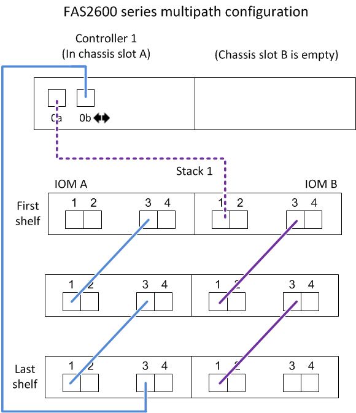

= Controller-to-stack cabling worksheets and cabling examples for platforms with internal storage - shelves with IOM12/IOM12B modules
:icons: font
:imagesdir: ../media/

[.lead]
You can use the completed controller-to-stack cabling worksheets and cabling examples to cable platforms with internal storage.

NOTE: This information does not apply to FAS25XX platforms.

* If needed, you can refer to link:install-cabling-rules.html[SAS cabling rules] for information about supported configurations, shelf-to-shelf connectivity, and controller-to-shelf connectivity.
* Cabling examples show controller-to-stack cables as solid or dashed to distinguish controller 0b port connections from controller 0a port connections.
+
image::../media/drw_fas2600_controller_to_stack_cable_type_key_IEOPS-947.svg[width=440px]

* Cabling examples show controller-to-stack connections and shelf-to-shelf connections in two different colors to distinguish connectivity through IOM A (domain A) and IOM B (domain B).
+
image::../media/drw_fas2600_cable_color_key.png[]

== FAS2800 platform in a multipath HA configuration with no external shelves

The following example shows that no cabling is needed to acheive multipath HA connectivity:

== FAS2800 platform in a tri-path HA configuration with no external shelves

The following cabling example shows required cabling between the two controllers to achieve tri-path connectivity:

image::../media/drw_fas2800_noshelf_tpha_IEOPS-955.svg[width=500px]

== FAS2800 platform in a tri-path HA configuration with one multi-shelf stack

The following worksheet and cabling example uses port pair 0a/0b1:

image::../media/drw_fas2800_worksheet_IEOPS-948.svg[width=530px]

image::../media/drw_fas2800_withshelves_tpha_IEOPS-949.svg[width=520px]

== Platforms with internal storage in a multipath HA configuration with one multi-shelf stack

The following worksheet and cabling example uses port pair 0a/0b:

NOTE: This section does not apply to FAS2800 or FAS25XX systems.

image::../media/drw_fas2600_mpha_worksheet_IEOPS-1255.svg[width=500px]

== FAS2600 series multipath configuration with one multi-shelf stack

The following worksheets and cabling examples use port pair 0a/0b.

In this example, the controller is installed in slot A of the chassis. When a controller is located in slot A of the chassis, its internal storage port (0b) is in domain A (IOM A); therefore, port 0b must connect to domain A (IOM A) in the stack.

image::../media/drw_fas2600_mp_slot_a_worksheet.png[]

In this example, the controller is installed in slot B of the chassis. When a controller is located in slot B of the chassis, its internal storage port (0b) is in domain B (IOM B); therefore, port 0b must connect to domain B (IOM B) in the stack.

image::../media/drw_fas2600_mp_slot_b_worksheet.png[]

image::../media/drw_fas2600_mp_slot_b.png[]
